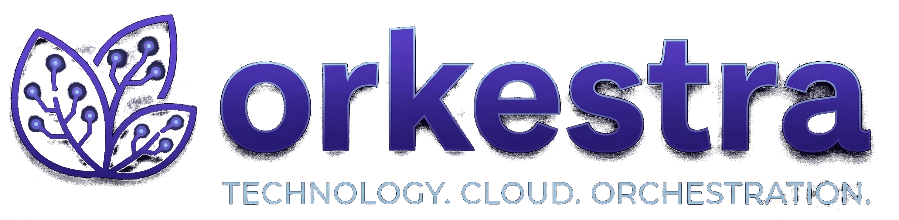

<div align="center">



**The plumbing every SaaS rebuilds — users, auth, RBAC, multi-tenancy, navigation, logging — already done. A core-only base you fork and build your product on top of.**

[](https://github.com/orkestra-cc/orkestra/actions/workflows/backend.yml)
[](https://github.com/orkestra-cc/orkestra/actions/workflows/frontend-admin.yml)
[](https://github.com/orkestra-cc/orkestra/actions/workflows/frontend-client.yml)
[](https://github.com/orkestra-cc/orkestra/actions/workflows/mobile.yml)
[](https://github.com/orkestra-cc/orkestra/actions/workflows/security.yml)

[](backend/)
[](frontend-admin/)
[](frontend-client/)
[](mobile/)

[](https://go.dev)
[](https://react.dev)
[](https://typescriptlang.org)
[](https://vite.dev)
[](https://flutter.dev)
[](https://www.mongodb.com)
[](https://redis.io)
[](https://docker.com)
[](https://huma.rocks)
[](https://www.openapis.org)
[](LICENSE)

[Quick Start](#quick-start) · [Architecture](CLAUDE.md) · [Backend](backend/CLAUDE.md) · [Frontend Admin](frontend-admin/CLAUDE.md) · [Frontend Client](frontend-client/CLAUDE.md) · [Docker](docker/CLAUDE.md)

</div>

---

## What is Orkestra

Every SaaS reinvents the same wheel: users, roles, password resets, OAuth with five providers, MFA, sessions, audit logs, multi-tenant isolation, billing. Three months of plumbing before the first real feature.

Orkestra is that plumbing, already done. Seven core modules — `user`, `auth`, `authz`, `tenant`, `notification`, `navigation`, `logging` — always load and give you email/password (argon2id) + OAuth 2.1 (Google, Apple, GitHub, Discord) + TOTP/WebAuthn MFA, RBAC with Cedar policies, orgs + memberships, runtime log-level admin, and audited-everything on day one.

Per [ADR-0006](docs/adr/0006-collapse-to-core-only-base.md) Orkestra is a **core-only base**: it ships no addons. The same `Module` extension seam the core is built on is the seam your fork uses to add invoicing, payments, AI, marketing, or whatever your product needs — in-tree, against the in-tree SDK contract, toggled per tenant at `/admin/modules` and hot-reloaded without a restart. Build your SaaS on top of the plumbing, not as another from-scratch repo.

It runs on a **two-tier tenancy model**: Tier-1 operators manage staff and module configuration; Tier-2 external clients register and manage their own org, users, and sub-tenants. The two-tier *data* model is built in; the *mechanism* for selling services to Tier-2 clients (catalog → subscribe → Stripe) left with the addons — a fork that needs it rebuilds it. See [CLAUDE.md](CLAUDE.md) for the full model.

## Architecture at a glance

- **Backend.** Go 1.25, [Huma v2](https://huma.rocks) (OpenAPI-first), modular monolith, single Go module. 7 core modules always load; the optional-module catalog ships empty — a fork registers its own at `/admin/modules` (hot-reload, no restart). See [backend/CLAUDE.md](backend/CLAUDE.md).
- **Frontend (admin).** React 19 + Vite 7 + TypeScript 5.9 strict. Navigation is fetched from `/v1/navigation` so the UI reflects whatever modules the backend has enabled. Cookie-based operator-audience auth. See [frontend-admin/CLAUDE.md](frontend-admin/CLAUDE.md).
- **Frontend (client).** Tier-2 customer-facing SPA on the same React 19 + Vite 7 stack, separate cookie domain, separate audience JWT. See [frontend-client/CLAUDE.md](frontend-client/CLAUDE.md).
- **Mobile.** Flutter 3.35 + Riverpod (early-stage).
- **Data.** MongoDB 8 + Redis 8, plus RustFS (S3-compatible) for uploaded blobs.
- **Auth.** Email + password (argon2id) and OAuth 2.1 (Google, Apple, GitHub, Discord), RS256 JWT, 6-role RBAC, optional TOTP + WebAuthn MFA, per-audience tier split for operator vs. client surfaces.
- **Observability.** Structured JSON logs with `trace_id` / `tenant_id` / `user_id` on every line out of the box, OpenTelemetry traces with tenant baggage (ADR-0001), Prometheus HTTP latency histogram with `trace_id` exemplars (one-click jump from a slow bucket to the matching Tempo trace), audit log kept separate from operational log. Zero-config locally; one env var to ship to a self-hosted Tempo + Loki + Grafana stack; one env var to ship to Honeycomb / Datadog / Grafana Cloud / Axiom. See [ADR-0005](docs/adr/0005-observability-logging-tracing-metrics.md).
## Quick Start

One infra base (MongoDB + Redis + RustFS) plus one app file per environment — `docker-compose.{dev,staging,prod}.yml` — with an opt-in `docker-compose.observability.yml` overlay. The dev stack runs on public Alpine images with AIR + Vite hot reload, no registry auth required.

```bash
make init                                                       # first time only — scaffolds docker/.env + JWT keys + network
cd docker
docker compose -f docker-compose.infra.yml up -d                # mongodb + redis + rustfs
docker compose -f docker-compose.dev.yml --env-file .env up -d  # backend (AIR) + both frontends (Vite)
```

Then open the operator console (`http://localhost:8080`) and the first-run **setup wizard** prompts you to create the first administrator (`POST /v1/setup/admin`, gated to first-install only). `make init` is idempotent — re-runs leave existing secrets alone — and creates the `orkestra-network` Docker bridge. The same operations are wrapped by `./orkestra.sh`; see [Managing the stack](#managing-the-stack).

**OAuth, SMTP, Stripe, AI keys are optional.** Email/password login works out of the box. Add the rest at `/admin/modules` after first login (see [OAuth setup guide](docs/site/operating/oauth-providers.mdx) for provider-specific instructions on Google, Apple, GitHub, Discord), or pre-seed by uncommenting the relevant lines in `docker/.env` before `docker compose up`.

### Forking the image registry

The compose files default to `ghcr.io/orkestra-cc/orkestra/backend:latest`. To run images built from your own fork (private registry, internal CI, air-gapped deploy), override at the shell:

```bash
BACKEND_IMAGE_REPO=ghcr.io/your-org/orkestra \
FRONTEND_IMAGE_REPO=ghcr.io/your-org/orkestra \
docker compose -f docker-compose.dev.yml --env-file .env up -d
```

To build the image yourself first:

```bash
cd backend && make build                          # produces ./bin/server
docker build -f Dockerfile -t ghcr.io/your-org/orkestra/backend:latest .
docker push ghcr.io/your-org/orkestra/backend:latest
```

The published image is produced by `.github/workflows/backend.yml` on every push to `dev` / `main` — a single build.

The dev backend builds `docker/Dockerfile.dev-backend` (`golang:1.25.10-alpine`, AIR pre-baked) — no registry auth needed. A fork with a [Chainguard](https://www.chainguard.dev) subscription can swap the base image via the `GO_BASE` build-arg.

## Managing the stack

`orkestra.sh` at the project root is the single entry point for every stack operation. It replaces the old `deploy.sh` and `logs.sh`.

**Interactive TUI.** `./orkestra.sh` launches a main menu (full stack / observability) followed by an operations menu with deploy, stop, status, and logs.

**CLI mode.** Every operation also works as a non-interactive command for scripting (`ENV` comes from `docker/.env` or an `ENV=...` prefix):

```bash
ENV=development ./orkestra.sh deploy --scope backend --rebuild --yes
./orkestra.sh status
./orkestra.sh logs orkestra-backend-dev -f
./orkestra.sh observability up
```

Run `./orkestra.sh --help` for the full command surface.

## Module catalog

### Core (always loaded)

| Module | Purpose |
| --- | --- |
| `user` | User CRUD, profile, system role, document tracking |
| `notification` | Email delivery, templates, preferences, unsubscribe |
| `tenant` | Organisations + memberships (two-tier tenancy) |
| `authz` | Permission catalog, roles, role bindings, Cedar policy engine |
| `auth` | Email/password + OAuth 2.1, JWT, sessions, RBAC, MFA |
| `navigation` | Dynamic menu aggregated from every module's `NavItems()` |
| `logging` | Runtime log-level admin (ADR-0005 Phase F): `log_levels` collection + `/admin/observability/log-levels` UI |

### Optional modules

The base ships **none** ([ADR-0006](docs/adr/0006-collapse-to-core-only-base.md)). A fork adds its own under `backend/internal/addons/<name>/` + `cmd/server/catalog_<name>.go`, and they appear at `/admin/modules`. Most of the verticals Orkestra used to ship (billing/SDI, documents, company, graph, aimodels, rag, sales, subscriptions, payments, compliance, identity, dev) are preserved as read-only snapshots at `github.com/orkestra-cc/orkestra-addon-<name>` to crib from. (`agents` and `marketing` were never split into standalone repos — their last in-tree state lives in this repo's history before the ADR-0006 removal.) See [Adding an addon](https://docs.orkestra.cc/contributing/adding-an-addon).

<details>
<summary>Old addon catalog (now archived)</summary>

| Module | Purpose |
| --- | --- |
| `billing` 🇮🇹 | Italian electronic invoicing (FatturaPA/SDI) |
| `documents` | PDF generation via Gotenberg |
| `company` 🇮🇹 | Italian business-registry lookup |
| `graph` | Memgraph knowledge graph |
| `aimodels` | Multi-provider AI model management (Ollama, OpenAI, Anthropic) |
| `rag` | Document ingestion + retrieval-augmented generation |
| `agents` | Hindsight AI agents with RAG context |
| `sales` | AI-driven prospect analysis and scoring |
| `subscriptions` | Recurring AI-services catalog, clients, activity log |
| `payments` | Stripe gateway: charges, refunds, webhooks |
| `compliance` | Platform audit log; future GDPR DSR pipelines, SOC2 evidence |
| `identity` | Per-tenant BYO OpenID Connect login + SCIM 2.0 stubs |
| `marketing` | Contact base + CSV/Excel importer + scoring + card lifecycle |
| `dev` | Dev token generator (disabled in production) |

</details>

## Observability, built in

Logging, tracing, and metrics are core platform features — same footing as `auth` or `tenant`, not a side quest. The promise is **simple by default, pro on demand**: zero configuration must produce useful output; opting into a self-hosted Grafana stack or a managed OTLP backend must require only environment variables, not code changes. See [ADR-0005](docs/adr/0005-observability-logging-tracing-metrics.md) for the full design.

### Multi-tenant log correlation, automatic

Every operational log line is auto-stamped with `trace_id`, `span_id`, `tenant_id`, `tenant_kind`, `user_id`, `user_role`, `audience`, and `request_id`. In Loki, "show me everything client X did in the last hour, across every module" is a one-liner:

```logql
{service="orkestra-backend"} | json | tenant_id="<uuid>"
```

The same `trace_id` jumps to the matching Tempo trace and to Prometheus exemplars on the `orkestra_http_request_duration_seconds` histogram (labelled by `audience`, `method`, route template, and `status_class`). No setup beyond pointing the backend at a collector.

### Three tiers, three env vars

| Tier | What you get | What you set |
|---|---|---|
| **0 — Zero config** | Structured JSON logs to stdout with trace + tenant correlation, Chi request log replaced by a typed middleware (allowlist-only, never logs bodies or auth headers), OpenTelemetry tracer running no-op, `/metrics` live. | `LOG_LEVEL=info` (default) |
| **1 — Self-hosted** | Adds Tempo (traces) + Prometheus (metrics) + Loki (logs) + Promtail (log shipper) + Grafana (datasources auto-provisioned with cross-jumping, "Tenant traces + logs" dashboard pre-loaded). Everything stays on operator hardware. | `./orkestra.sh observability up` (or option 3 in the TUI) |
| **2 — OTLP-native** | Ships traces and logs to any OTLP-compatible vendor — Honeycomb, Datadog, Grafana Cloud, Axiom, New Relic. Stdout remains the source of truth; OTLP is an additive fanout so a collector outage never loses lines. | `OTEL_EXPORTER_OTLP_ENDPOINT=https://…` + `OTEL_TRACES_ENABLED=true` (traces) + `OTEL_LOGS_ENABLED=true` (logs) + `OTEL_EXPORTER_OTLP_HEADERS` for auth |

### Audit log ≠ operational log

The `compliance` module's audit sink (append-only `audit_events` in MongoDB) is **never** conflated with operational logs. Audit is forever, never sampled, drives SOC2/GDPR evidence. Operational is retention-bounded, lives in Loki or the vendor backend. Operators can drop the operational tier entirely (regulated air-gapped deployments) without losing audit fidelity.

### Per-module debug, no global noise

```bash
LOG_LEVEL=info LOG_LEVEL_RAG=debug docker compose -f docker-compose.dev.yml up
```

RAG ingestion floods with detail; the rest of the backend stays readable. Every line emitted from a module is auto-stamped with `module=<name>` by the module registry (`pkg/sdk/module`), so the slog handler can gate on it without any code change in the module itself.

ADR-0005 Phase F adds an admin page at `/admin/observability/log-levels` to flip the same levels at runtime without restarting — every module logger picks up the change instantly through a shared `atomic.Pointer` snapshot.

### PII-safe by construction

Request logging is **allowlist-only**: only the enumerated fields (`method`, `path`, `status`, `duration_ms`, `bytes`, `request_id`, `trace_id`, `span_id`, `tenant_id`, `tenant_kind`, `user_id`, `user_role`, `audience`, `remote`, `ua`, `slow`) ever reach stdout. No bodies, no `Authorization` headers, no raw query strings. New fields require an ADR amendment. This is what makes the logging surface GDPR-safe by design, not by ad-hoc denylist scrubbing.

## Adding a new module

### Backend

1. Create `backend/internal/addons/<name>/module.go` implementing the `Module` interface.
2. Create `backend/cmd/server/catalog_<name>.go` with an `init()` that registers the factory in `optionalModules`.
3. Declare `Collections()`, `NavItems()`, `ConfigSchema()`, `Dependencies()`.
4. Use `shared/iface` interfaces for cross-module dependencies. Never import another module's `services/` or `repository/` package directly.

See [backend/CLAUDE.md](backend/CLAUDE.md) for the full convention.

### Frontend

The React app reads enabled modules from `/v1/navigation` at boot and only renders routes for modules the backend has turned on. Add per-module UI under `frontend-admin/src/modules/<name>/`. The `src/modules/_template/README.md` scaffold walks through the pattern. See [frontend-admin/CLAUDE.md](frontend-admin/CLAUDE.md).

## Repository layout

```
orkestra/
├── backend/                 # Go modular monolith — single Go module
│   ├── cmd/server/          # The binary (catalog.go + empty optionalModules)
│   ├── internal/
│   │   ├── core/            # Always loaded: user, notification, tenant, authz, auth, navigation, logging
│   │   │                    # (internal/addons/ does not exist in the base — a fork adds it)
│   │   └── shared/          # config, database, middleware, blob, container, …
│   ├── pkg/sdk/             # In-tree SDK: Module, registry, iface, …
│   ├── tools/               # tenantscope + policycoverage CI gates
│   └── Dockerfile           # Multi-stage (dev + prod)
├── frontend-admin/          # React 19 + Vite 7, operator console (Tier-1)
├── frontend-client/         # React 19 + Vite 7, external client SPA (Tier-2)
├── mobile/                  # Flutter 3.35
├── docker/                  # Compose files + env templates
├── docs/                    # Architecture and modernization docs
├── .github/workflows/       # Backend, frontend, mobile, security CI
└── scripts/                 # devtoken.sh, env-validate.sh, ...
```

## Quality gates

Every pull request runs through:

- **Lint.** golangci-lint (gocritic, gosec, prealloc, nolintlint) on the Go backend.
- **Tenant-scoping analyzer.** Custom `tools/tenantscope` static check enforcing invariant #1 from ADR-0001: every MongoDB read/write in an addon must derive its filter from `shared/tenantrepo.Scope`.
- **Policy coverage.** `tools/policycoverage` reconciles every declared permission against Cedar policies + route middleware, fails on uncovered drift.
- **Tests.** `go test -race` with a Mongo + Redis service matrix and a 15 % coverage floor.
- **Vulnerability check.** `govulncheck` against the latest Go 1.25.x stdlib + module deps, with an allowlist for upstream-unfixed Docker SDK CVEs.
- **Single binary build.** One build per push validates `cmd/server` compiles cleanly with every addon.
- **Docker push.** On push to `dev` / `main`, the image is pushed to GHCR as `ghcr.io/orkestra-cc/orkestra/backend:latest` and `:<sha>`. On a release tag push (`vX.Y.Z`) all images additionally get version tags — `:vX.Y.Z`, `:X.Y.Z`, and the floating `:X.Y` — so a deploy can pin an exact release. Applies to all three images (`backend`, `frontend`, `frontend-client`).

### Coverage snapshot

| Project | Coverage | How it's measured |
| --- | --- | --- |
| Backend | 15.6 % | `go test -race -coverprofile=coverage.out ./...` (15 % floor enforced in CI) |
| Frontend Admin | 3.2 % | `npm run test:coverage` (vitest + @vitest/coverage-v8) |
| Frontend Client | no tests | `vitest` is not configured yet |
| Mobile | 60.3 % | `flutter test --coverage` (`coverage/lcov.info`) |

The coverage badges in the header are SVGs committed to `.github/badges/`. Each CI workflow's test job refreshes its own SVG on push to `dev` or `main` (badge fetch from shields.io + `stefanzweifel/git-auto-commit-action`); commit messages are tagged `[skip ci]` to avoid re-trigger loops. The `frontend-client` badge stays static until that project has tests.

## Contributing

We welcome contributions. The full guide is in [CONTRIBUTING.md](CONTRIBUTING.md); the short version:

```bash
curl https://mise.run | sh && exec $SHELL                  # install mise (one binary)
echo 'eval "$(mise activate bash)"' >> ~/.bashrc           # activate shims (zsh: ~/.zshrc + `zsh`)
exec $SHELL                                                # reload so the eval takes effect
mise install                                               # provision Go/Node/Flutter at pinned versions
make install                                               # bootstrap all dependencies
pre-commit install --install-hooks                         # auto-format on commit, CI on push
make ci                                                    # run the same checks GitHub Actions runs
```

`make ci` auto-detects which surfaces (`backend`, `frontend-admin`, `frontend-client`, `mobile`) you touched and runs only those. CI workflows invoke the same `make` targets, so local-green ≡ CI-green by construction. Run `make ci-help` for the full target list.

We use [Conventional Commits](https://www.conventionalcommits.org/) (enforced by the `commit-msg` hook) and the [two-tier tenancy model](CLAUDE.md#tenancy-model) is load-bearing — every endpoint and every collection must declare its tier.

## License

Licensed under the [Apache License, Version 2.0](LICENSE). See [`NOTICE`](NOTICE) for attribution. Contributions are accepted under the same license — see [CONTRIBUTING.md](CONTRIBUTING.md). Security disclosures: [SECURITY.md](SECURITY.md). Community conduct: [CODE_OF_CONDUCT.md](CODE_OF_CONDUCT.md).
