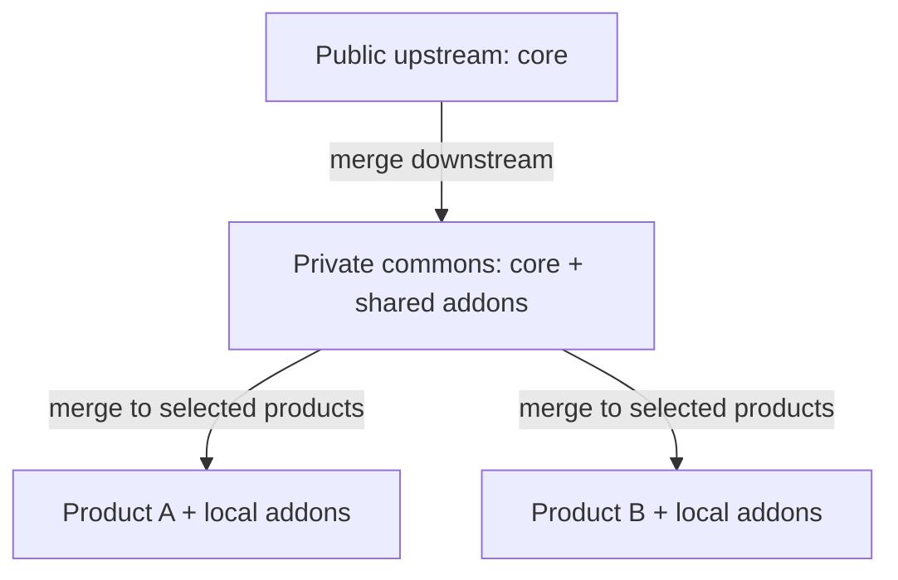

# Development stack and delivery workflow

**Date:** 2026-09-06; development, delivery, private Forgejo target, permission matrix, three-VM runner topology, blocking shared-data checklist, daily routine and operational design updated 2026-09-07  
**Status:** Private Forgejo/Actions/registry target, three-VM runner topology with 2/1/1 concurrency, development model, blocking shared-data checklist, daily reconciliation routine, delivery VM topology, product/environment permission matrix, high-level release/rollback policies and access/secrets/backup operational design selected; job isolation validation, runtime/access enforcement, daily report automation, numerical recovery targets, detailed procedures, sizing and rollout pending.  
**Audience:** Operators maintaining the public base, a private commons repository,
and one or more product repositories.

Target self-hosted Forgejo for private repositories, delivery tracking, Actions
and container images. Use Worktrunk for local worktrees and the existing
Orkestra toolchain to build and verify changes. GitHub remains the current
platform and may continue hosting public upstream; no migration has occurred.
Keep work records and Git operations portable rather than dependent on one forge.

This document records the operating model to adopt. It does not provision VMs
or a tracker, install Worktrunk, configure hooks, migrate repositories, or
deploy services. Worktrunk was not available on the documentation author's PATH when
this guide was written; its examples were checked against the documentation
linked below, not executed against an installed version.

## Decision and scope

The repository topology remains the one defined by
[ADR-0010](../adr/0010-commons-fork-chain.md):



Upward contributions use isolated, reviewed changes. Never merge a private
repository's history into the public upstream. The repositories may live on
different forges: keeping public upstream on GitHub while moving private
repositories to the selected Forgejo target preserves the same Git topology.
GitLab remains a documented alternative, not a second selected destination.

The selected workflow does not depend on developing a CodeOps addon. Vibe
Kanban is an alternative when an integrated agent workspace becomes useful;
it is not part of the initial stack. Existing CodeOps work in a private fork
is outside this rollout and is not removed by this decision.

## Stack and responsibilities

| Layer                 | Selected target / current implementation                        | Responsibility                                                                                             |
| --------------------- | -------------------------------------------------------------- | ---------------------------------------------------------------------------------------------------------- |
| Code and history      | Forgejo for private repositories; GitHub currently              | Commits, branches, tags and merge ancestry                                                                 |
| Delivery tracking     | Private coordination repository, proposed name `orkestra-work` | Work ownership, required destinations and outstanding follow-ups                                           |
| Work visualization    | Private Forgejo Projects targeted                              | Views over issues and PRs; essential facts also remain in issues                                           |
| Local workspaces      | Worktrunk                                                      | Create, inspect, navigate and remove worktrees per repository                                              |
| Editing and agents    | Existing editor and coding agents                              | Work within the assigned repository and branch                                                             |
| VM provisioning       | Proxmox; OpenTofu + Ansible automation targeted                | Declare VM resources and configure their guest systems in the operator's private infrastructure repository |
| Development runtime   | Docker through `orkestra.sh`                                   | Existing application and infrastructure lifecycle                                                          |
| Toolchains and checks | `.mise.toml`, `make`, pre-commit                               | Reproducible versions and repository checks                                                                |
| Remote checks         | Forgejo Actions targeted privately; GitHub Actions currently    | Execute the repository's `make` targets                                                                    |
| Application images    | Forgejo container registry targeted privately; GHCR currently   | Store versioned application artifacts for explicit digest-based promotion                                  |

Existing GitHub Projects can carry custom views and metadata over issues and
PRs. Preserve essential facts in issues when moving to Forgejo; do not assume
those fields and automations have equivalent features on the destination.
[GitHub Projects documentation](https://docs.github.com/en/issues/planning-and-tracking-with-projects/learning-about-projects/about-projects),
[Forgejo Projects](https://forgejo.org/docs/latest/user/collaboration/project/).

Worktrunk reports local Git state; it does not determine Orkestra ownership or
prove that a fix reached every product. A tracker does not discover work left
only on a developer's disk. Both require the reconciliation routine below.

The [approved operations contract](development-operations.md) selects persistent
per-dev-VM Caddy ingress with private NetBird access, SOPS/age bootstrap and
OpenBao runtime secrets, PBS-backed recovery coverage and measured sizing.
These are design decisions, not installed services or validated recovery targets.

### Approved private platform target

**Decision confirmed on 2026-09-07:** Forgejo is the destination for the private
setup: commons, product repositories and private coordination, with Forgejo
Actions and its integrated container registry. This replaces the earlier
GitHub-first target for the new private setup, not the current live services.
Public upstream can remain on GitHub; neither moving it nor changing its CI
is authorized by this decision. GitLab CE remains an evaluated alternative.

The registry supports OCI images; the approved release flow still promotes
exact application image digests rather than rebuilding in production.
[Forgejo container registry](https://forgejo.org/docs/latest/user/packages/container/).
Hostnames, storage placement, retention, recovery and access policy remain to
be selected in the private infrastructure inventory. Keep the registry's
persistent data distinct from disposable build caches and product datasets.

The approved execution layout separates the Forgejo/registry server from
three runner VMs: one for verification/build, one for staging operations and
one for production releases. They are shared across products, not allocated
per product. The targets are **two build jobs, one staging operation and one
production operation concurrently**, as detailed below. Resource figures are
pilot hypotheses; no dedicated VM has been provisioned by this choice.

Validate the workflow adapters and authorization controls on the selected
Forgejo and runner versions; copying GitHub Actions YAML or assigning a
runner label is not proof of compatibility or deployment authorization.
The migration pilot below must preserve work records and establish one
writable authority per migrated repository. Until cutover is explicitly
performed, existing GitHub repositories and GHCR artifacts remain in place.
No repositories, remotes, workflows, images, credentials or services are
migrated, published, removed or reconfigured by this documentation update.

### Approved private CI concurrency target

**Decision confirmed on 2026-09-07:** start with two simultaneously executing
verification/build jobs across the entire private pool, shared by commons and
product repositories. Further eligible jobs wait in the queue. This is not
two jobs per repository, developer, runner or worktree, and not two complete
pipelines: one pipeline can contain several jobs that consume the same budget.
Jobs running on public upstream's GitHub-hosted runners are outside this pool.

The four-worktree target per development VM is unchanged. Local editor/agent
checks are not private CI jobs and remain part of development VM capacity.
Deployment execution has separate capacity so queued builds do not directly
occupy its execution slots. The [runner topology below](#approved-runner-topology)
adds one staging operation and one production operation at a time; this does
not remove shared physical-host resource contention.

Implement and validate the aggregate two-job limit across all eligible build
runners; do not accidentally multiply it when adding a runner. Job-internal
parallel tests, compilers, service containers and caches still consume
resources inside each slot. Measure a representative pair of simultaneous
jobs before finalizing CPU, RAM, disk and cache budgets. The three-VM layout
is selected; job isolation, scheduler enforcement and resource limits still
need validation. These targets are not yet enforced scheduler settings,
sizing results or provisioning authorization.

### Approved runner topology

**Decision approved on 2026-09-07, subject to a pilot:** use three runner VMs
in addition to the separate Forgejo/registry server. None runs on a developer
VM or on a product's staging/production VM. Share the runners across private
products and commons; public upstream's GitHub-hosted CI remains outside this
pool. Labels below describe roles, not final inventory hostnames.

| Runner VM role | Work | Concurrent work across all eligible products | Pilot vCPU | Pilot RAM | Pilot total disk |
| -------------- | ---- | -------------------------------------------- | ---------- | --------- | ---------------- |
| Build | Verification, compilation and authorized image publication | 2 jobs | 8 | 16 GiB | 160 GiB |
| Staging deploy | Product-scoped staging start/stop and candidate deployment | 1 operation | 2 | 4 GiB | 25 GiB |
| Production deploy | Approved image promotion and compatible application rollback | 1 operation | 2 | 4 GiB | 25 GiB |

The indicative runner-only budget is **12 vCPU, 24 GiB RAM and 210 GiB disk**.
It excludes Forgejo/registry, application environments and other infrastructure.
It is not a physical CPU reservation or proof of host capacity. Validate the
combined RAM, storage and I/O budget before assigning inventory sizes; the
build disk includes disposable workspace/cache capacity, not registry storage.

Further eligible operations wait. A new request must not automatically cancel
an in-progress deployment. One staging operation and one production operation
may proceed alongside the two build jobs; production is not queued behind
staging. Serialization must cover the whole operation, including multi-job
workflows, not merely set each runner's job capacity to one. Locking, retries
and recovery after an interrupted operation remain implementation work.

**Build isolation to evaluate in the pilot:** create a temporary LXC job
environment with its own Docker daemon, workspace and test services. These
are containers inside the build VM, not extra Proxmox VMs. MongoDB/Redis and
other test data are disposable per job; never connect CI to shared dev or
staging datasets. Do not expose a common Docker daemon or the runner host's
socket to concurrent jobs. Validate cleanup and cache trust boundaries between
jobs; PR jobs must not receive image-publication credentials.

Forgejo's LXC execution does not support workflow `services:` and does not
provide built-in LXC resource limits. Adapt test-service startup inside the
job, and validate resource controls outside that workflow before rollout.
The current [backend CI](../../.github/workflows/backend.yml) uses `services:`
for Redis and starts MongoDB through Docker, so it cannot be copied unchanged.
Temporary job environments also do not establish that Forgejo's separate
ephemeral-runner registration mode is configured or that a VM is recreated.
[Forgejo Docker access and LXC limitations](https://forgejo.org/docs/latest/admin/actions/docker-access/),
[Forgejo runner security and resource controls](https://forgejo.org/docs/latest/admin/actions/security/).

**Deployment boundary:** register deploy runners only with a restricted
operational repository, not generally with all product repositories. They
execute controlled delivery procedures, never application builds or PR tests.
A workflow editable by a product contributor or a matching runner label must
not grant access to a deploy runner. Enforce the
[permission matrix](#approved-product-and-environment-permissions)
and release approval with product/environment-scoped credentials. Network
policy restricts each deploy runner to its authorized staging or production
destinations; build jobs receive no production administration access.

The accepted topology shares a kernel between build jobs and a deploy runner
between products in the same environment. This is not hardware isolation per
job or product. A fourth VM splitting the two build slots remains an alternative
to review if the pilot cannot provide adequate isolation or maintainability;
it is not an automatically approved expansion.

The pilot must demonstrate two simultaneous representative jobs with separate
test data/daemons, bounded resource use and cleanup; denial of PR publication
and deploy access; product/environment authorization; and queued, non-cancelling
delivery operations. Three-VM topology approval does not implement the pilot,
enable production credentials or authorize provisioning existing or new VMs.

## What lives where

| Change                                               | Authoritative repository                           | Normal delivery                                 |
| ---------------------------------------------------- | -------------------------------------------------- | ----------------------------------------------- |
| Generic core fix                                     | Public upstream                                    | Upstream PR, then commons and selected products |
| Private common functionality or shared addon         | Commons                                            | Commons PR, then selected products              |
| Product-specific addon, adapter or configuration     | Owning product                                     | Product PR only                                 |
| Reusable extension needed by a product customization | Commons for the extension; product for the adapter | Two linked changes with an explicit dependency  |

Start planned work in its authoritative repository. An urgent product hotfix
may temporarily precede its authoritative fix, following the exception below.
An addon developed for one product can remain local indefinitely. Promotion on
second use follows ADR-0010 and keeps product-specific behavior local.

Retain ADR-0010's existing `Prop: upstream | private | addon` trailers and
one-category-per-commit discipline. Product-only work has no propagation
destinations; its private changes use `Prop: private`. The words `public`,
`shared` and `product` describe repository roles, not new trailer values.
This guide does not introduce `Prop: public` or migrate existing classifiers.

`Prop:` expresses routing intent. It is neither proof of delivery nor a
substitute for inspecting a public contribution's content.

## Development VM topology

**Topology approved on 2026-09-06; runtime model revised on 2026-09-07:** use
one development VM per codebase, with separate application runtimes for task
worktrees. They normally share the codebase's persistent development infra
and the same development dataset, concurrently. Different datasets or dedicated
infra are explicit exceptions. Use common provisioning for every VM.
Neither one VM for all codebases nor one VM per worktree is the selected model.

The initial planning baseline is one public upstream, one private commons and
at least four products, with at least four codebases under active development
at once. Names below are logical examples, not provisioned machines or a public
inventory of private products. Actual VM names follow the infrastructure
repository's canonical naming convention, not a second convention introduced
by these aliases.

| Development VM  | Owning codebase                  | Concurrent development capacity to validate |
| --------------- | -------------------------------- | ------------------------------------------- |
| `upstream-dev`  | Public base                      | 4 app runtimes + shared dev infra/data      |
| `commons-dev`   | Private base and reusable addons | 4 app runtimes + shared dev infra/data      |
| `product-a-dev` | Product A                        | 4 app runtimes + shared dev infra/data      |
| `product-b-dev` | Product B                        | 4 app runtimes + shared dev infra/data      |
| `product-c-dev` | Product C                        | 4 app runtimes + shared dev infra/data      |
| `product-d-dev` | Product D                        | 4 app runtimes + shared dev infra/data      |

This defines six development VMs, not six permanently running stacks. At the
selected concurrency target, four active codebases mean capacity for 16 task
worktrees; all six mean capacity for 24. Inactive VMs may be stopped after their
work is saved and their active consumers are checked; stopping is not deletion.

This is an operational boundary, not a claim that six VMs are the cheapest
option. It trades more guest systems to maintain for predictable per-codebase
ownership and resource allocation. VMs sharing a physical host still share
that host's failure domain and compete for its finite capacity.

### Team-wide concurrency target

**Target confirmed on 2026-09-06: four simultaneously active task worktrees per
codebase, shared by the whole team and its agents.** It is not four per person,
per agent or per local clone. For example, one developer can use two worktrees
while two colleagues use one each. A person and an agent taking turns in the
same worktree do not count as two worktrees; the one-writer rule still applies.

That rule concerns writers editing the same source workspace. It does **not**
limit the common dataset to one application backend: multiple worktree
backends may use the same dev data simultaneously as the normal workflow.

Team members need both browser access to task stacks and development access
with editors, agents and worktrees. The proposed workspace arrangement uses
individual accounts and personal Git clones inside the owning codebase VM.
The [shared VM blueprint](development-vm-blueprint.md) records the selected
privilege direction and proposed bootstrap/capacity details; those details
remain subject to implementation review and runtime validation.
Adding a developer or a personal clone does not multiply
the VM's four-worktree capacity target.

**Pilot direction confirmed on 2026-09-07:** use Docker rootless per developer.
The [earlier implementation plan](../superpowers/plans/2026-09-07-rootless-development-pilot.md)
is superseded and must not be executed: it assumed dedicated data/infra per
task. It needs revision against the shared-data contract in the
[blueprint](development-vm-blueprint.md#shared-development-environment).
Neither provisioning nor runtime validation has been executed.

Keeping a worktree does not automatically start its application. Capacity
testing must cover four simultaneous app runtimes against one shared infra
and dataset, including concurrent agent checks and builds. Also test the
explicit isolation exception; extra infra capacity needs its own measurement.
VM sizing is not yet validated. The baseline is no longer four full copies
of MongoDB, Redis and RustFS per VM.

This is a planning and operating target, not an implemented scheduler or a
hard limit on worktrees retained on disk. Additional paused worktrees may be
kept with an owner and review date. When four tasks are already active, agree
which work to pause or explicitly revise capacity before adding concurrent
load; do not automatically evict a colleague's stack or delete their files.

### Code and runtime stay together

The owning VM hosts the repository checkout, linked worktrees, agent processes
and Docker runtime. An editor may connect remotely, but the code mounted by
Docker lives on the same VM as that Docker daemon. Do not introduce remote
source synchronization or shared writable source mounts between development
VMs as part of this baseline.

The upstream → commons → products chain distributes code through Git. A
product contains its integrated core and addons; it does not need running
upstream or commons application stacks to consume that code. Carry out an
authoritative fix on its owning development VM and propagate through the
existing repository workflow, not by copying another VM's working directory.

The common VM setup must provide the same toolchain installation mechanism,
workspace layout convention, Worktrunk profile, Docker lifecycle entry point
and host registration procedure. Repository versions remain pinned by each
checkout's `.mise.toml`. Machine identities and per-task app identities remain
distinct; the selected data environment supplies its existing connection and
data-key references. Do not clone a live developer machine or generate new
encryption keys for an existing dataset. The workspace/bootstrap contract is in
the [shared VM blueprint](development-vm-blueprint.md); the automation still
needs approval, implementation and verification.

### Provisioning ownership

**Platform confirmed on 2026-09-06:** Proxmox hosts the VMs; OpenTofu and Ansible
are the selected direction for replacing manual VM creation and configuration.
Their rollout is not assumed complete.

The responsibility split is:

- **Private infrastructure repository:** canonical VM identities, resource
  sizes, placement, network and operational policies. OpenTofu manages the VM
  resources; Ansible configures the guest from the derived inventory.
- **Codebase repositories:** application code, pinned development toolchains,
  checks and the application runtime contract used by `orkestra.sh`.
- **Coordination repository:** work ownership and links to the canonical host
  and repository records, not another editable copy of VM addresses or sizes.
- **Task tools on the development VM:** create worktrees and manage their
  explicitly associated stacks; creating a worktree does not run OpenTofu.

OpenTofu supports declarative infrastructure lifecycle management; Ansible
supports guest configuration through playbooks. This division is the workflow
chosen here, not a limitation on what either tool can automate.
[OpenTofu overview](https://opentofu.org/docs/intro/),
[Ansible introduction](https://docs.ansible.com/projects/ansible/latest/getting_started/introduction.html).

Keep provider credentials, state and privileged provisioning execution outside
the application development stacks. Do not bake them into development VM
templates. Private infrastructure details and operational inventories stay in
their owning repository; this public guide records only the general contract.

Before implementation, align the infrastructure-side guest setup and any
deployment wrapper with the application repository. A single-stack application
role is not automatically a multi-worktree developer setup. Avoid maintaining
two independent, drifting definitions of the Orkestra services. Guest
configuration must not implicitly release application changes or remove task
workspaces. The VM-to-codebase mapping and developer bootstrap remain integration
work to specify, not capabilities established by this documentation.

### Worktree and runtime lifecycle

The required association is:

**Work-ID → repository and branch → VM/worktree → app identity/URLs + infra reference + data-environment reference.**

Record this binding with the activity's workspace. Common infra/data belong
to a persistent codebase environment, not to a disposable worktree. Record
its owner and consumers separately from the app's running/stopped state.
The [approved infra ownership model](development-vm-blueprint.md#approved-infrastructure-ownership-and-access)
uses a dedicated rootless service account on that VM, with an environment
maintainer and substitute. Personal app daemons connect through private service
endpoints and application credentials, never the infra account's Docker socket.
This is a target operating contract, not a
claim that Worktrunk or `orkestra.sh` already creates and reconciles the mapping.
Use the [runtime isolation rules](#runtime-isolation) for each running task.

Treat these as distinct operations:

- **Create a worktree:** allocate a task workspace; starting containers is optional.
- **Start its application:** verify identity, source path, ports and the chosen
  infra/dataset binding and pass the
  [blocking compatibility checklist](development-shared-data-checklist.md).
  The normal binding reuses the common dev data; resume and changed runtime
  inputs, including hot reload, must revalidate the applicable checks.
- **Stop its application:** stop only that worktree's runtime; preserve shared
  services, data and other consumers, including the same user's other apps.
  The existing app-only stop needs adaptation to the independent infra binding.
- **Stop or reset shared infra/data:** a separate coordinated environment
  operation, never a side effect of worktree stop, cleanup or bootstrap.
- **Remove its runtime resources:** separately verify and approve the exact
  containers and data to retire; do not infer permission to delete volumes from
  a stopped stack or a closed PR.
- **Remove its worktree:** first verify durable retention and the absence of
  runtime consumers, using the [cleanup checks](#cleanup-and-reconciliation).

The [approved closure contract](development-vm-blueprint.md#approved-worktree-closure-contract)
uses a blocking Worktrunk `pre-remove` integration to stop and verify only the
bound application before managed removal. A failure blocks removal; even the
last worktree does not stop shared infra. Hooks and attachment-only lifecycle
are not implemented, and reconciliation still covers removals that bypass them.

At reconciliation, report running stacks with missing source paths or missing
work records. A worktree with no running stack is normal. An unreachable VM is
unchecked, not clean. Worktrunk inventories remain local to a repository and
host; the private roster and coordination issues provide the cross-VM context.
Any future aggregation must read actual Git and runtime state and preserve
those evidence boundaries, without creating a second work-status database.

### Boundary with staging and production

Development VMs are the place for editing, agents and hot reload. Staging is
for validating an identified candidate version, not a second
development VM with task worktrees mounted into its application. Production
runs a deliberately released version. A branch named `dev` is not itself a
runtime environment, and a deployment does not change a worktree's ownership.

**Release-flow and topology decisions are selected; detailed deployment design
remains in progress.** CI builds versioned application images automatically;
the team explicitly requests a staging deployment and, after validation,
approves promotion of the same image digests to production with
environment-specific configuration. The rollback policy below is selected;
the private platform target is Forgejo Actions and its container registry.
Exact CI branch/tag triggers, registry storage/access/retention, runner
host sizing and job isolation, permission enforcement and membership,
detailed rollback procedures and each
product's numerical recovery objectives and recovery procedures still need
their own design approval.

This is not the current implementation: the checked-in
[staging Compose file](../../docker/docker-compose.staging.yml) uses AIR/Vite
and source bind mounts; the
[production Compose file](../../docker/docker-compose.prod.yml) defines local
image builds. Artifact-based deployment must be implemented and verified
through the sanctioned lifecycle workflow before claiming image promotion works.

#### Approved staging and production topology

**Decision approved on 2026-09-07:** use one production VM per deployed product
and one shared staging VM with independent product stacks. These VMs are
separate from development VMs; staging does not share a VM with production.

| Environment | Selected placement | Application and data boundary |
| ----------- | ------------------ | ----------------------------- |
| Production | One VM per product | Product-owned persistent MongoDB, Redis and RustFS; two application slots during a blue/green release |
| Staging | One shared VM initially | One independent stack per product, including its own backend, frontends, MongoDB, Redis and RustFS |

Sharing the staging VM does **not** share databases or service instances
between products. Give each product distinct stack identities, networks,
ports/URLs, volumes and credentials; staging data and secrets also remain
separate from development and production. The development rule allowing
multiple worktree applications onto one codebase's dataset does not mean
different products share a staging dataset. Per-product lifecycle operations
must leave other products and shared host services alone.

For four products in production, this means **five delivery VMs**: four
production VMs plus one staging VM. Together with the six selected development
VMs, the initial application-environment topology has **eleven VMs**. This is
not a count of all infrastructure VMs: forge, registry, runners, ingress and
other platform services require their own placement decisions. It does not
require a production deployment of upstream or commons merely because they
have development VMs.

The trade-off accepted for shared staging is fewer guest systems to maintain
in exchange for shared capacity and a shared failure/maintenance boundary.
Independent stacks are not independent VMs. Production VMs on the same physical
host likewise do not provide protection against that host failing.

Topology approval is not capacity approval or provisioning authorization.
Size staging for the agreed peak of simultaneously active product stacks,
including release-validation overlap where needed; stopping some stacks is
not a substitute for setting that budget. Each retained dataset still needs
disk and backup capacity. Production capacity must include both application
slots during deployment. No existing VM may be replaced or deleted under this
design approval alone.

#### Approved deployment availability target

**Decision approved on 2026-09-07:** target ordinary application deployments
without user-perceived interruption, using application-only blue/green slots
on the same production VM. Planned maintenance windows are acceptable for
infrastructure changes. This is a design target to validate, not an implemented
zero-downtime guarantee or an availability SLA.

The current application keeps serving traffic while the replacement backend
and frontends start in a separate slot. Readiness and smoke checks precede a
reverse-proxy traffic switch; existing requests drain before the old slot is
stopped. The production MongoDB, Redis and RustFS services and their data
remain persistent and are not duplicated or restarted by an ordinary
application release. Both slots refer to the same production data environment.
Blue and green are **two production application versions**, not staging and
production: staging keeps separate data, credentials and service endpoints.
The proxy implementation is not selected; the
[HAProxy blue/green example](https://www.haproxy.com/documentation/haproxy-configuration-tutorials/proxying-essentials/custom-rules/map-files/)
illustrates the traffic-switching pattern, not a tool commitment.

Before claiming this target works, validate readiness failures, traffic
switching and draining, long-lived connections/reconnection, sessions, old
frontend assets and API compatibility, and background-job ownership during
overlap. Data changes must support the old and new application versions during
the rollback window. Returning traffic to the old image does not undo data
written by the new version; incompatible data changes need a separately
reviewed migration and recovery procedure, with maintenance if required.
See the [blue/green data compatibility guidance](https://docs.aws.amazon.com/whitepapers/latest/blue-green-deployments/best-practices-for-managing-data-synchronization-and-schema-changes.html).

Budget capacity for persistent services plus both application slots during
deployment, including startup peaks and rollback retention. This need not
double the whole stack, but it is not free capacity: measure CPU, RAM, disk and
database load before sizing. No additional-host purchase or cost saving has
been established.

This baseline does **not** provide high availability for a VM, physical host,
proxy or datastore failure. Two application slots on one host share that
host's failure risk. Infrastructure failover and its independent capacity are
outside this initial target; backup and recovery remain required design work.
VM allocation follows the selected topology above. Explicit deployment requests
follow the release flow below. The failure/rollback policy is selected below;
maintenance duration, exact CI triggers and detailed rollback procedures are
still undecided.

#### Team-controlled staging activation

**Decision confirmed on 2026-09-07:** team members decide whether each product's
staging environment should be active or stopped. Staging does not have an
always-on requirement; a test or demo can keep it active for as long as the
team needs it. No automatic idle timeout or shutdown schedule is selected.

Treat stopping as suspension, not deletion: retain the environment identity,
recorded release, configuration/key references and persistent data. Starting
it again must not silently deploy a newer image or reset its dataset. A new
release, a data reset and decommissioning are separate operations. These are
the lifecycle safeguards to implement and validate, not existing automation.

Team members authorized for that product's staging must coordinate with other
staging users before stopping an active environment. The permission scope is
selected in the [matrix below](#approved-product-and-environment-permissions);
the control surface, membership and enforcement remain to be designed. This
decision does not grant general administrative access to VMs or production.

On the selected shared staging VM, stopping one product must leave the other
products and shared host services running; the VM itself can stop only when no
remaining consumer needs it. Stopped containers still occupy disk, and retained
VM disks/data still need storage and backup capacity even while the VM is
powered off. Peak concurrency and resource admission remain design decisions;
team-controlled activation is not a capacity limit.

#### Approved release flow

**Decision approved on 2026-09-07:** automate checks and versioned image builds,
but require an explicit team request to deploy a chosen candidate to staging
and explicit approval to promote it to production. Automation executes the
deployment; this is not permission to edit or rebuild application source on
the destination VM.

1. **Prepare a candidate:** CI checks the product's code and produces versioned
   application images. A passing build makes a candidate available; a merge
   does not automatically start or update staging and does not deploy to
   production. Exact eligible branches/tags and version naming remain to be
   selected.
2. **Deploy to staging:** a team member authorized for that product's staging
   explicitly selects a built candidate, coordinating with current testers
   and demo users. Record
   the candidate's source revision and application image digests so validation
   refers to an exact release, not whichever image a moving tag resolves to.
3. **Promote to production:** after staging validation and explicit approval
   by an authorized production approver, deploy that same set of application
   image digests using the selected blue/green flow. Do not rebuild images
   for production. A changed image set is a new candidate requiring its own
   validation, not the previously approved release.

Environment activation and version deployment remain separate operations:
starting stopped staging resumes its recorded version and retained data;
updating staging installs an explicitly chosen candidate. A deploy request
targeting stopped staging must make any activation explicit. The control
surface and first-deployment/bootstrap procedure remain to be designed.

Promotion moves **application artifacts**, not staging data or credentials.
Environment-specific configuration must be supplied without rebuilding the
images; validate this for every product frontend as well as the backend.
Each product has its own candidates and approvals: integrating an upstream or
commons change is not permission to deploy all downstream products.

This is not the current pipeline. For example, the existing
[backend image publishing job](../../.github/workflows/backend.yml) is gated by
`CI_FULL`; product forks default to minimal CI. Define and verify the product
artifact-publication path and complete application image set before claiming
automatic candidates or artifact promotion are available. This decision does
not enable repository variables, publish images or configure deployment access.
Forgejo Actions and its registry are the selected private platform target.
The [three-VM runner layout](#approved-runner-topology) and one-operation limit
for each deployment environment are selected; execution isolation and durable
serialization still need implementation and validation. Production approver
membership, approval enforcement, detailed failure checks and artifact
retention remain design work; the rollback policy below defines the approved
automation boundary.

#### Approved product and environment permissions

**Decision approved on 2026-09-07:** grant permissions by **product/codebase ×
environment × operation**, not by team membership or VM access alone. Dev,
staging and production are environments; application start/stop, candidate
deployment, production approval and rollback are distinct operations.

| Environment | Authorized people | Permitted operations |
| ----------- | ----------------- | -------------------- |
| Dev | Developers enabled for the codebase | Create worktrees and start, update or stop their own application runtime within the shared four-slot target |
| Staging | Team members enabled for that product's staging | Start/stop that product's stack and explicitly request deployment of a chosen candidate, coordinating with its users |
| Production | A restricted group of release approvers for that product | Approve promotion of the validated image set and explicitly request a compatible application rollback |

Permissions do not automatically carry over to other products or environments.
One person can hold several explicit grants; staging access for product A
does not grant production access for A or staging access for B. Upstream and
commons use the codebase-scoped dev rule; this does not require adding staging
or production environments for either repository.

Dev remains an autonomous hot-reload workflow, not a release-approval gate on
every edit. The four active app/worktree slots are shared across the codebase's
developers and agents, not allocated per person. Managing one's app must not
stop another worktree or the common infrastructure. Shared infra stop/reset,
dataset reset, volume deletion and data restoration are separately authorized,
coordinated operations. The deliberately shared writable dev dataset remains
a shared trust boundary, not isolation between application versions.

VM administration, general Docker control, secret administration and data
recovery are separate permissions, not consequences of release authority.
On the shared staging VM, network access alone is not a product-level control:
execute staging operations through pipelines constrained to the authorized
product's stack, without granting a general administrative shell or unrestricted
Docker access. Stopping one product must preserve the others and their data.

This is the approved permission model, not an implemented access-control
system. Exact group names, memberships, service identities and enforcement
remain private infrastructure design work. Validate cross-product and
cross-environment denials, worktree ownership, revoked access and the absence
of VM/Docker administration bypasses before rollout.

#### Production approval authority

**Requirement confirmed on 2026-09-07:** only an explicitly authorized subset
of users may approve production deployments. Team membership alone does not
grant this authority. The approved matrix scopes that authority per product,
environment and operation. Actual membership and enforcement remain open.
Keep actual identities and access mappings in the private infrastructure
source of truth, not this public guide.

**Proposed access boundary, not yet implemented or validated:** use NetBird
to restrict administrative connectivity, while separately checking release
approval before a deployment can obtain production credentials. NetBird
network policies and its identity-aware SSH policies can restrict reachable
resources and permitted OS accounts; they do not by themselves establish
approval of a particular product, environment, source revision and image set.
[NetBird access policies](https://docs.netbird.io/manage/access-control),
[NetBird SSH authorization](https://docs.netbird.io/manage/peers/ssh).

Prefer approval through the forge without automatically granting the approver
an administrative shell on production. A trusted deployment runner executes
the approved operation; verification/build jobs must not receive production
access. A manual workflow trigger, a runner label or a protected ref is not
sufficient proof of release approval. Forgejo job OIDC identifies a workflow
execution, not an independent human approval; bind checked approval to the
exact release and enforce it at the production credential/access boundary.
[Forgejo Actions OIDC](https://forgejo.org/docs/latest/user/actions/security-openid-connect/).
The concrete approval mechanism, group mapping, revocation behavior and
negative authorization tests must be designed and validated on the selected
versions before enabling production deployment access.

#### Approved release failure and rollback policy

**Decision approved on 2026-09-07:** automatically abort a failed candidate
before traffic switching; require an explicit team request for an application
rollback after switching; never automatically restore the database as a
release-failure response.

- **Before the traffic switch:** if the new slot fails readiness or smoke
  checks, abort the release without routing user traffic to it. Keep the
  currently serving application in place. This is an aborted deployment, not
  a database rollback: candidate startup or checks may already have touched
  shared data, so data-version compatibility remains a prerequisite.
- **After the traffic switch:** the team may explicitly request a return to
  the previous application release only while it remains compatible with the
  current data. Identify the actually serving release before acting; an
  incomplete or uncertain switch is not proof that the old slot still serves
  all traffic. Missing compatibility evidence or required artifacts prevents
  treating application rollback as a safe recovery path.
- **Data problems:** use a separately reviewed recovery procedure. Reverting
  application images does not undo writes made by the new version, and
  restoring an older backup can discard valid operations performed since
  that recovery point. No automatic database restore, dataset reset or reverse
  data migration is authorized by a failed release.

Retain the application artifacts and configuration references needed for the
agreed rollback window; its duration and cleanup policy are still to be set.
Define exact checks, timeouts, switch-state verification and operator controls,
then test both pre-switch failure and post-switch rollback before claiming the
policy is operational. Data recovery separately needs acceptable data-loss and
service-restoration targets, backup coverage and retention, and restore tests.
This decision selects behavior only; no deploy, rollback, backup or restore
automation has been changed or executed.

#### Product-specific recovery requirements

**Decision confirmed on 2026-09-07:** acceptable loss of recent production data
differs by product. Do not impose one numerical recovery point objective
(RPO) on every product or silently treat an unspecified value as an agreed
default. No product's numerical target has been selected in this discussion.

RPO describes how much recent data may be lost after a failure. Recovery time
objective (RTO), the target time to restore service, is a separate requirement
still to be agreed; application deployment availability does not determine
either objective. Record which failure scenarios each objective must cover.
See the [recovery-objective definitions](https://docs.aws.amazon.com/wellarchitected/latest/framework/rel_planning_for_recovery_objective_defined_recovery.html).

Define the actual product requirements with the owning team in the private
infrastructure repository, alongside the canonical environment/backup
declarations. Keep this public guide generic; do not publish private product
names, recovery commitments, backup destinations or secret material here.
The implementation contract for that per-product record remains to be designed.
It needs the agreed data-loss and restoration targets, covered data/services,
backup retention, ownership and restore-test evidence. Staging and development
coverage require their own decisions rather than inheriting production
commitments merely because they use the same application code.

Choose backup frequency and the detailed data capture/recovery procedure only
after those requirements are known. The later
[operational decision](development-operations.md#approved-backup-and-restore-coverage)
selects PBS VM backups with an off-site copy as the foundation and explicitly
covers unpublished development work, application state and required keys.
Validate recovery of a usable product state, including database records,
object data and the required configuration/key references;
do not infer an achieved RPO/RTO solely from a successful scheduled backup.
Different targets may use common tooling, but neither a numerical target nor a
backup schedule, retention or application-consistency procedure is selected.
Do not inherit a generic infrastructure RPO for every product. Strict product
requirements may require revisiting the single-VM production baseline;
topology approval is not proof that every
future recovery target can be met.

### Decisions required before provisioning

Use the selected Proxmox/OpenTofu/Ansible foundation. The next design step
confirms available host capacity, the approved guest template and the developer
bootstrap contract in the private infrastructure repository, using the
[bootstrap and pilot proposal](development-vm-blueprint.md). Then validate a
representative VM with four app runtimes sharing dev infra/data, measuring
memory, CPU, disk growth and build contention before choosing VM sizes and
runtime limits. Include a separately measured isolation exception. Budget
apps, shared services, OS, agents and builds together; do not give each
component limits derived independently from the full VM capacity.
Containers are not resource-limited by default.
[Docker resource constraints](https://docs.docker.com/engine/containers/resource_constraints/).

The [operational design](development-operations.md) now selects development
preview ingress, secret authorities and backup/restore coverage. Finalize actual
domains and access policies, account/endpoint/credential delivery, exception-data
initialization, recovery targets and executable backup/restore procedures in
the private infrastructure repository. Validate them alongside the VM pilot;
an approved design alone does not admit the fleet or authorize team rollout.
A fresh-start design is not authorization to destroy existing VMs or their
contents: confirm what must be retained before any later replacement.

## Durable records

Use the private coordination repository for work spanning repositories and
for internal product work. A public contributor can continue using an ordinary
public issue and PR; internal routing details stay in the private tracker.

| Record                                                                                                      | Where it belongs                                                                                     |
| ----------------------------------------------------------------------------------------------------------- | ---------------------------------------------------------------------------------------------------- |
| Repository roster: logical name, role, parent, URL, integration branch, owner, active/retired status        | Versioned document in the private coordination repository                                            |
| VM roster: logical identity, owning codebase, role, owner, connection reference and provisioning revision   | Canonical private infrastructure inventory; coordination records link to it rather than duplicate it |
| Work objective, owner, destinations, follow-ups and completion evidence                                     | Coordination issue                                                                                   |
| Commit content and ancestry                                                                                 | Git                                                                                                  |
| Repository-specific integration and checks                                                                  | PR or MR, linked from the coordination issue                                                         |
| Host, checkout and worktree path, branch, current worker, stack identity, URLs and retained data references | Workspace record in the coordination issue                                                           |
| Recipes and conventions                                                                                     | Repository documentation and shared tool configuration                                               |

Agent memory may cache these records but must not become their only copy.
Do not duplicate mutable work status into a second Git/YAML or application
database. Private rosters and customer details must not enter the public base.

Allocate a unique, permanent `Work-ID` when opening an activity, for example
`ORK-2026-0042`. Check the coordination tracker before allocating an ID and
never reuse it. Include it in related branches and commits. Preserve it if the
forge changes its issue numbers or URLs; a bare `#42` is not a portable identity.

For larger work, use one coordination issue with linked destination issues or
PRs. Native sub-issues can improve navigation, but Markdown links and a
destination checklist must remain sufficient. GitHub supports sub-issues in
different repositories. [GitHub sub-issue documentation](https://docs.github.com/en/issues/tracking-your-work-with-issues/using-issues/adding-sub-issues).

### Coordination issue template

The following is a template to fill in, not a record of an existing task:

```markdown
Work-ID: <unique permanent ID>
Owner: <person accountable for completing or handing off the work>
Authoritative repository: <logical repository name>
Scope: <module or paths and intended behavior>
Acceptance: <observable result and required checks>

## Required destinations

| Repository   | Purpose                                    | Responsible person | Next review | State   | Evidence or next action |
| ------------ | ------------------------------------------ | ------------------ | ----------- | ------- | ----------------------- |
| <repository> | <authoritative fix or downstream delivery> | <person>           | <date>      | pending | <issue/PR/MR link>       |

## Workspaces

| Host   | Repository   | Branch                      | Worktree path | Current worker | Disposition |
| ------ | ------------ | --------------------------- | ------------- | -------------- | ----------- |
| <host> | <repository> | <branch containing Work-ID> | <path>        | <person/agent> | active      |

## Development runtimes

| Host   | Worktree path              | App identity | URLs                | Infra / data environment                                             | Runtime disposition                                              | Retained data references                |
| ------ | -------------------------- | ------------ | ------------------- | -------------------------------------------------------------------- | ---------------------------------------------------------------- | --------------------------------------- |
| <host> | <registered worktree path> | <app ID>     | <browser endpoints> | <shared or dedicated infra ref / shared dev or separate dataset ref> | <not created, running, stopped or retired; checked at timestamp> | <owner/consumer references, no secrets> |

## Handoff

Next action: <concrete remaining step>
Next review: <date if paused or blocked>
Retained workspace: <reason and review date, if kept after completion>
App left running: <reason, responsible person and review date, if applicable>
Release/deployment: <outside scope, or links to separately tracked work>
```

For shared-data runtimes, also link the
[compatibility evidence record](development-shared-data-checklist.md#evidence-record-and-blocked-outcome):
qualified profile/dataset revision, effective source/config identity, A/B check
results with evidence and owners, and worker assignment. An issue checkbox
does not replace the runtime admission gate. This is a check result, not an
additional manually maintained task-state label.

Use exactly one current-state label: `state:planned`, `state:active`,
`state:review`, `state:propagating`, `state:blocked`, `state:done` or
`state:cancelled`. The board reflects that label; do not maintain another
manually edited state field in the issue body. Close the issue only for `done`
or a documented cancellation. If the tracker disagrees with Git or the PR,
investigate and correct it before reporting completion.

## Daily development workflow

### Approved session and review cadence

**Decision approved on 2026-09-07:** personal checks at the start and end of
each working session, an automatic daily read-only reconciliation report, and
a weekly review of anomalies. Worktrunk handles local Git workspaces; the
tracker owns responsibilities and propagation. A small report connects those
sources without introducing a CodeOps addon or another work-status database.
The cadence is selected; report collection/scheduling and lifecycle hooks
are not implemented by this document.

**At session start, the work owner:**

- Reviews their tasks, outstanding destinations and report anomalies, checking
  collection timestamps and unavailable sources before trusting a clean result.
- Resumes an existing Work-ID before allocating duplicate work; verifies the
  repository, branch/source path and the selected infra/dataset binding.
- Checks actual app activity and available capacity across the codebase's
  users. Four active app slots are shared by the whole VM, not by each clone.
  Retained worktrees without running apps do not consume those runtime slots.
- Starts/resumes their app explicitly through the adapted `orkestra.sh` only
  after the [compatibility gate](development-shared-data-checklist.md) passes.
  Creating or selecting a worktree must not implicitly start its application.

**At session end, the work owner:**

- Saves unfinished work durably to the correct repository or approved private
  retention location; does not publish secrets or private history upstream.
- Records what remains, the concrete next action and next review date before
  handing off or leaving work paused. Agent/chat termination is not a handoff.
- Normally stops only their task app and its workers, preserving common infra
  and data. If the app needs to remain running, records its reason, responsible
  person and review date. This is an explicit owner action, not an idle timer
  authorized to stop someone else's work.
- Closes a finished workspace through the verified closure path or explicitly
  retains it with an owner, reason, durable work reference and review date.
  A stopped, deliberately retained worktree is normal, not abandoned.

**Daily:** the report surfaces mismatches for owners to address; it does not
change task status, stop apps or delete anything. **Weekly:** the environment
maintainer or substitute reviews codebase anomalies with the work owners,
including overdue reviews and hotfix propagation. Owners resolve, reassign or
explicitly reschedule their work; they do not clear warnings by hiding records.
The report's collection/access/scheduling design and notification destination
remain implementation work, with no cron, workflow or message delivery enabled.

### Task lifecycle

1. **Open or select the work.** Record ownership, acceptance criteria and the
   exact required destinations. The repository roster determines available
   products; it does not authorize syncing all of them.
2. **Prepare the workspace.** Fetch the intended base, create a short-lived
   branch/worktree and register it on the issue. One independently integrable
   task in one repository owns one worktree, with one writer at a time.
   Sequential implementation, test and documentation steps share that workspace.
3. **Implement and verify.** Follow repository instructions, preserve scoped
   commits and run the checks appropriate to the affected surfaces. Save any
   unfinished work durably before an agent or person hands it off.
   Shared-data code execution also requires the compatibility gate above;
   stop the app before contract-sensitive edits unless a validated reloader
   blocks their execution until fresh checks pass.
4. **Review and integrate.** Open a PR/MR against the repository's integration
   branch, normally `dev`. Record the actual integrated commit and check results.
   Recheck the resulting integration when its base has changed materially.
5. **Propagate.** Follow the destination records individually. A source PR
   merging moves the overall activity to `propagating` if deliveries remain.
6. **Close the workspace and activity.** Verify the completion conditions below.
   A finished chat is not a completed delivery.

The owner remains accountable when an agent stops. Paused work needs a next
action and review date. A blocked destination remains visible and does not
prevent independent destinations from progressing.

### Hotfix discovered in a product

For a generic core or shared-addon defect:

1. Open a coordination issue with both the urgent product fix and the return
   to the authoritative repository as required destinations. In an incident,
   capture the follow-up during the handoff before marking mitigation complete.
2. Isolate the fix from product customization. If the patch depends on local
   behavior, prepare and verify the general version separately.
3. Integrate the urgent patch into the affected product using its normal checks.
4. Transfer the scoped fix to commons or a clean upstream-based branch. Link
   the original and resulting commits: cherry-picks can change their SHA.
5. After the authoritative fix merges, deliver it downstream to the selected
   products and verify the return merge into the originally patched product.
   Do not apply the hotfix twice merely because the commit IDs differ.

Close the product mitigation task when its own acceptance criteria pass.
Keep the coordination issue open until the authoritative fix and all required
deliveries have an explicit outcome.

For a product-only defect, classify it as local and record that no upward
delivery is required. Do not create a shared propagation obligation by default.

Each required destination needs its responsible person, next review date,
next action and PR/commit/check evidence in the coordination issue. Keep
mitigation and overall completion visible separately: a product mitigation
can be closed while the parent remains `state:propagating` (or `state:blocked`
when it cannot progress). Use tracker views/filters over those existing labels,
not a second manually maintained status. The daily report must surface missing
authoritative follow-ups and overdue destinations even after the original
product's PR has merged. Integration alone does not prove deployment; retain
separate release evidence when mitigation requires a running fix.

Choose an urgent hotfix's base against the version being corrected; do not
automatically use `origin/dev`. Develop it on the owning development VM, not
inside a staging/production checkout. Later return merges must account for
adapted/cherry-picked equivalents, not apply a patch twice based only on SHA.

## Worktrunk operating profile

Install Worktrunk using its [installation guide](https://worktrunk.dev/#install)
on a pilot workstation first. Record the tested version in the private setup
documentation before rolling it out to other hosts.

Configure shell integration and the local comparison branch in each clone
where `dev` already exists:

```bash
wt config shell install
wt config state default-branch set dev
wt config state default-branch
```

The branch override is clone-local and shared with linked worktrees; it does
not change the forge's default branch. Use a persistent worktree directory
outside disposable chat scratchpads, with both repository and branch in its
path. Share repository hooks through `.config/wt.toml`; keep workstation
paths and credentials local. [Worktrunk configuration](https://worktrunk.dev/config/).

Example after selecting the correct repository and allocating the illustrated
Work-ID; replace the example branch name for each new activity:

```bash
git fetch origin
wt switch --create fix/ORK-2026-0042-notification --base origin/dev
wt list
```

Worktrunk supports an explicit base for new branches. Confirm the actual path
and branch, then add them to the issue's workspace record.
[Worktrunk switch documentation](https://worktrunk.dev/switch/).

Use `wt list --branches` to include local branches without worktrees. Optional
forge status can supplement these local checks after authentication is set up.
Repeat the inventory for each registered clone and development host; this is
not a global dashboard. [Worktrunk list documentation](https://worktrunk.dev/list/).

To enter an existing task workspace without requesting app startup:

```bash
wt switch fix/ORK-2026-0042-notification
```

The selected hook profile must preserve that distinction: neither creation
nor navigation starts application containers. Inspect the actual configured
hooks during onboarding; this guide does not configure them. An existing
branch without a worktree may have one created by `wt switch`, so verify and
record the returned path. App startup and data admission are still separate.

The initial adoption uses workspace creation, inspection and cleanup. Keep
integration through the established PR/MR workflow. Worktrunk's `wt merge`
defaults include squash and rebase; adopting that command would need a separate
configuration decision to preserve the fork chain and scoped `Prop:` commits.
[Merge configuration](https://worktrunk.dev/config/#merge).

### Runtime isolation

The primary checkout may already be bind-mounted into a running Docker stack.
A new worktree does not redirect that stack to the new code. Do not switch the
primary checkout's branch underneath it.

Use the existing [Docker stack conventions](../../docker/CLAUDE.md) and
`orkestra.sh` for runtime work. Each task has distinct source mounts, app
identity, ports and browser origins. **Data are shared by default**, through
an explicit binding to the codebase's dev environment. Separate data or full
infra isolation are selected exceptions, not automatic worktree creation.
Do not copy the primary `.env` and start duplicate stacks. Never start backend
or frontend servers manually.

The current lifecycle always ensures local infra services during deployment;
it does not yet implement attachment-only deployment or shared-infra cleanup
guards. Do not use an identical `APP_NAME` as a sharing shortcut: it also
collides application/container identities. Implement and test the revised
[runtime contract](development-vm-blueprint.md#shared-development-environment)
before treating this workflow as available.

The [approved data-compatibility checklist](development-shared-data-checklist.md)
adds a blocking codebase qualification gate and per-WT admission/revalidation.
Unknown or stale compatibility blocks shared use; isolated data remain an
explicit exception. Ordinary validated edits stay autonomous. Startup writes,
hot reload, keys/session behavior, caches, workers, indexes and shared module/
bucket configuration are in scope. Automated enforcement is still pending;
four green health checks or a completed PR checklist do not certify coexistence.

Keep toolchain versions in `.mise.toml` and checks in `make`, as described in
[CONTRIBUTING.md](../../CONTRIBUTING.md). Worktree hooks should invoke those
existing checks where appropriate, without introducing automatic deployment.

### Cleanup and reconciliation

Follow the [approved session/daily/weekly cadence](#approved-session-and-review-cadence)
and compare the tracker with worktrees, local-only branches and open PRs.
Review the registered host roster, not just whichever VM is reachable today.
Record unavailable hosts, accounts and tracker/API sources as unchecked rather
than assuming they are clean.

| Finding                                              | Action                                                                               |
| ---------------------------------------------------- | ------------------------------------------------------------------------------------ |
| Workspace without a work record                      | Identify its owner and register or recover the work                                  |
| Workspace without a responsible owner                 | Assign or recover ownership; do not infer permission to remove it                     |
| Integrated branch with a remaining worktree          | Check local files and consumers, then close the workspace                            |
| Modified files or unpublished commits                | Save and link the work; retain it until recovery is verified                         |
| Work declared handed off but retained only locally    | Resolve durable retention and correct the handoff evidence                           |
| Inactive activity or stopped agent                   | Assign a next action and review date                                                 |
| Review date overdue                                  | Ask the responsible owner to resume, hand off, close or explicitly reschedule         |
| Missing or partially emptied directory               | Inspect Git registration and retained commits; do not interpret it as completed work |
| Running stack with a missing worktree or work record | Identify its source and owner; report the mismatch before cleanup                    |
| Completed task with an app still running              | Verify its recorded reason/owner/review date or arrange explicit app-only stop        |
| Unavailable development VM                           | Record the host as unchecked and retain its outstanding workspace records            |
| Product hotfix without an authoritative follow-up    | Classify it and create the missing destination record                                |

Worktrunk's `Age` column means **time since the last commit**, not last human
or agent activity. Never use it, file age or a silent agent as proof that work
is abandoned. Use ownership, runtime state and the recorded review date.
[Worktrunk list columns](https://worktrunk.dev/list/#columns).

**No automatic cleanup:** report generation, age thresholds and overdue reviews
never authorize stopping containers, removing worktrees/branches, pruning
volumes or resetting data. The owner makes a scoped decision after inspection.

Before removing a worktree, confirm there is no active person, agent or
container using it; inspect staged, unstaged, untracked and relevant ignored
files; and verify that commits and necessary artifacts are durably retained.
An old timestamp, clean `git status`, or integrated HEAD alone is insufficient.

After those checks, an example cleanup preserving the branch is:

```bash
wt remove --foreground --no-delete-branch fix/ORK-2026-0042-notification
git worktree list --porcelain
```

Confirm completion and update the workspace record. Branch deletion can follow
after its integration and retention requirements are verified. Do not force
cleanup or use broad filesystem deletion as routine housekeeping. Worktrunk
documents foreground removal and retaining the branch.
[Worktrunk removal documentation](https://worktrunk.dev/remove/).

Managed closure must invoke the
[approved app-only stop/verification contract](development-vm-blueprint.md#approved-worktree-closure-contract)
before directory removal, with failures blocking the operation. A configured
`pre-remove` hook is not sufficient evidence that the guard actually ran:
Worktrunk allows skipped hooks and continues without project commands when
their approval is declined. Validate that the managed path requires the guard,
and report direct/bypassed removals through reconciliation. Do not use force or
skipped hooks as normal closure. [Worktrunk hook approval](https://worktrunk.dev/hook/#security).

### Daily read-only report contract

Aggregate the authorized per-user Git/worktree and runtime summaries against
the canonical private VM/repository roster and coordination issues. Worktrunk's
`wt list --format=json` is a possible local input, not a cross-user/VM inventory
by itself. Runtime collection must respect personal rootless ownership; do not
share infra or developer Docker sockets with colleagues to simplify reporting.
The access/collector mechanism must be specified and tested before rollout.

The report shows, per workspace: Work-ID, codebase, VM/owner, branch/path,
app identity and actual running/stopped/unknown state, infra/dataset references,
compatibility-check result/freshness, Git retention warnings and next review.
Include outstanding hotfix destinations and links to their owners/evidence.
Read only the necessary metadata; no `.env` contents, tokens, private keys or
customer data in report output. Keep private work metadata off public upstream.

Show collection time and source coverage, including failed collectors and
stale Git/forge data. Missing data are **unknown**, never zero runtimes or an
empty hotfix queue. A retained last-known snapshot must be visibly dated, not
presented as live. A stale report cannot satisfy runtime admission or closure.

The output is a derived read-only view, not a new source of task status. It
does not fetch-and-merge branches, change work labels, deploy, stop, prune or
delete. No report CLI or scheduler is installed yet. Before adoption, test a
missing owner, an overdue review, a deliberately retained stopped WT, a running
app with missing source, incomplete host/account/API access and a mitigated
hotfix still missing authoritative propagation. Each must produce the correct
finding without mutating the inspected work or runtime.

## Propagation and completion evidence

Retain the merge/cherry-pick boundaries and generated-file rules in the
[private-fork guide](../site/getting-started/private-forks.mdx). Verify push
destinations after cloning or changing remotes; disable public push URLs in
private checkouts. Public fixes are prepared from the public history and
reviewed without private code, customer details or private tracker content.

Record the integration commit and verification for every required destination.
An ancestry comparison can measure merge delivery, but cannot establish that
an adapted or cherry-picked patch works. For example, after fetching the
remote named `commons` in a product clone:

```bash
git log --oneline dev..commons/dev
```

This lists commons commits absent from local `dev`; `commons/dev..dev` is the
opposite direction. Both use local refs, so stale refs must be refreshed first.
[Git revision-range documentation](https://git-scm.com/docs/gitrevisions#_dotted_range_notations).

Run the target product's applicable checks after a sync. Passing commons CI
does not verify product-only addons. A new forge must keep invoking the same
`make` targets rather than copying their test logic into provider-specific YAML.

An activity can be marked `done` only when:

- the authoritative change is integrated and its acceptance checks pass;
- each required destination is verified as delivered or explicitly waived by
  the work owner with a reason;
- remaining worktrees are removed or deliberately retained with an owner,
  durable work reference and review date;
- release/deployment requirements, if any, have their own linked outcomes.

A deferred required delivery keeps the activity open. If scope changes, retain
the reason and link the separate follow-up; do not erase the original obligation.
PR/MR auto-close keywords should close only the repository task they actually
finish, not a coordination issue with outstanding deliveries. Board completion
rules are a team procedure until an explicit automation enforces them.

Integration, release and deployment are separate milestones. A merge or green
check does not by itself demonstrate that a running environment was updated.

## Portability to Forgejo or GitLab CE

**Destination selected on 2026-09-07: Forgejo for the private setup.** The
comparison below retains GitLab as an alternative, not a pending platform
choice or an additional deployment. Public upstream can stay on GitHub.

Support statements below were checked on 2026-09-06. Verify the installed
versions and instance settings during a migration pilot.

| Capability                   | GitHub currently                  | GitLab CE / Free alternative                | Forgejo private target                                              |
| ---------------------------- | --------------------------------- | ------------------------------------------- | ------------------------------------------------------------------- |
| Local Worktrunk workflow     | Git-based                         | Same local workflow                         | Same local workflow                                                 |
| Worktrunk forge integration  | GitHub integration                | GitLab integration, including `glab`        | Gitea integration path is experimental; test on the target instance |
| Required tracking primitives | Issues, labels and Markdown links | Issues, labels and links across projects    | Issues, labels and Markdown links                                   |
| Board                        | Private Project                   | Project boards; one group board in Free     | Kanban projects                                                     |
| CI adaptation                | Existing Actions workflows        | Translate orchestration to `.gitlab-ci.yml` | Adapt and test Forgejo Actions workflows                            |

Worktrunk can explicitly select a forge on a custom hostname. Its documented
Gitea support is experimental, including the configuration path suggested for
Forgejo; do not promise feature parity for remote PR/CI operations.
[Forge configuration](https://worktrunk.dev/config/#forge-platform),
[GitLab CLI usage](https://worktrunk.dev/faq/#what-commands-does-worktrunk-execute).

GitLab Free supports one group issue board and related issues across projects;
epics and native blocking relationships require paid tiers. The workflow above
therefore uses ordinary linked issues and explicit next actions.
[GitLab boards](https://docs.gitlab.com/user/project/issue_board/),
[linked issues](https://docs.gitlab.com/user/project/issues/related_issues/),
[epics](https://docs.gitlab.com/user/group/epics/).

Forgejo projects provide Kanban boards for issues. Do not assume GitHub Project
fields, hierarchy or automation have a one-to-one mapping.
[Forgejo projects](https://forgejo.org/docs/latest/user/collaboration/project/).

### Migration sequence

1. Pilot one private repository and representative work records. Verify Git
   branches/tags, issues, comments, attachments, PR/MR history and stable Work-IDs.
   Check the importer report; a Git mirror alone does not transfer issue data.
2. Recreate the tracker views and required checks. Preserve a map from old
   repository/issue/PR URLs to new ones and repair outstanding delivery links.
3. Port CI orchestration, credentials, branch protection, release handling,
   registry publishing and documentation triggers. Validate these integrations
   individually; importing code is not evidence they were migrated.
4. Test Worktrunk creation, inspection, forge status and cleanup on the new host.
   Keep standard Git and forge UI operations available where an integration is
   unsupported. Update provider-specific agent recipes and CLI authentication.
5. Announce a cutover window, reconcile changes since the pilot and establish
   one writable source per migrated repository and tracker. Update local remotes,
   push guards and roster entries. Preserve the source read-only until verification
   and recovery requirements are satisfied.

GitLab documents its GitHub import scope and limitations. Its CI requires
translation; Forgejo explicitly does not guarantee GitHub Actions compatibility.
[GitLab importer](https://docs.gitlab.com/user/project/import/github/),
[GitLab CI migration](https://docs.gitlab.com/ci/migration/github_actions/),
[Forgejo Actions differences](https://forgejo.org/docs/latest/user/actions/github-actions/).

The private forge choice is now settled, but the migration is not scheduled
or executed. Forgejo's tracking model and Worktrunk integration still require
the pilot above; target selection does not establish feature parity.

## Adoption milestones

All new setup below is pending. Update this table with dated evidence as each
milestone is completed; routine delivery status belongs in the tracker.

| Milestone               | Deliverable                                                         | Acceptance                                                                                                                               | Status        |
| ----------------------- | ------------------------------------------------------------------- | ---------------------------------------------------------------------------------------------------------------------------------------- | ------------- |
| Baseline inventory      | Private repository/host roster and existing-work inventory          | Every discovered worktree, unpublished branch and known hotfix has a disposition                                                         | Pending       |
| Development VM pilot    | Reproducible per-codebase VM setup and measured capacity            | Four app runtimes share dev infra/data across team accounts with concurrent checks; an isolation exception and capacity are measured     | Pending       |
| Tracker setup           | Forgejo coordination repository, issue template, labels and Project | A sample work record exposes all required destinations without relying on custom fields                                                  | Pending       |
| Worktrunk pilot         | Tested version, local configuration and persistent workspace layout | Create, resume, inspect and safely close one task against `dev`                                                                          | Pending       |
| Runtime lifecycle pilot | Explicit app/infra/dataset bindings and safe reconciliation         | Four branches serve distinct code on the same dev data; stopping one preserves shared infra and other apps; exception data stay separate | Pending       |
| Shared-data compatibility | [Blocking checklist](development-shared-data-checklist.md) and runtime enforcement | Gate A qualifies the codebase/addons; gate B blocks missing/stale/incompatible inputs before startup writes and hot-reloaded execution | Pending       |
| Daily routine and reporting | [Approved cadence](#approved-session-and-review-cadence), read-only collectors and report | Session handoff is resumable; report detects orphan/overdue/hotfix cases and incomplete coverage without automatic cleanup; weekly review has an owner | Pending |
| Operational readiness | [Approved operations contract](development-operations.md), private configuration and recovery procedure | Preview allow/deny, secret delivery/refresh, isolated restore of data and unpublished work, agreed recovery targets and whole-host capacity admission are verified | Pending |
| Runner pilot            | Approved three-VM topology and measured 2/1/1 concurrency           | Isolated build jobs, scoped deployment authority, operation serialization and combined resource limits pass the runner pilot above       | Pending       |
| Delivery pilot          | One shared change delivered to one selected product                 | Source integration, target checks and cleanup evidence are linked from one issue                                                         | Pending       |
| Hotfix pilot            | Product-first fix returned to its authoritative repository          | Product mitigation closes independently; overall work closes only after required deliveries                                              | Pending       |
| Team adoption           | Shared recipes and regular reconciliation                           | Another person or agent can resume paused work from the issue and Git state                                                              | Pending       |
| Forge migration         | Selected Forgejo destination; migration plan and pilot pending      | The migration sequence above passes on a pilot before cutover                                                                            | Not scheduled |

The first rollout needs configuration and working habits, not a new Orkestra
service. Add small integrations only after the pilot identifies a repeated gap;
keep work ownership and delivery evidence in the selected tracker.
