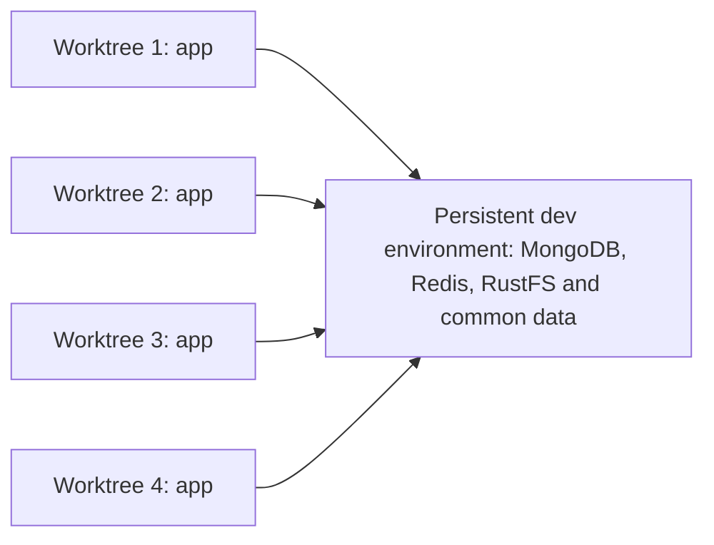

# Shared development VM: bootstrap and pilot

**Date:** 2026-09-06; decision updated 2026-09-07  
**Status:** Concurrent shared-dev-data baseline, dedicated rootless infra ownership, private endpoint access, app-only worktree closure, blocking data-compatibility checklist and operational design approved; concrete access/secret configuration, numerical recovery targets, sizing, implementation and validation pending.  
**Parent decision:** [Development stack and delivery workflow](development-stack.md).

One VM per codebase and four simultaneous task worktrees per VM, shared by
the team and its agents, are confirmed. On 2026-09-07 the operator approved
proceeding with the rootless-per-user pilot, then clarified that simultaneous
worktree apps should normally reuse both infra and the same dev dataset.
The shared infrastructure now has an approved dedicated service-account owner
and connects to personal app daemons through private service endpoints.
Different data and dedicated infra are exceptions. This supersedes the earlier
one-complete-stack-per-worktree assumption. The
[earlier implementation plan](../superpowers/plans/2026-09-07-rootless-development-pilot.md)
is not executable until replaced against this contract. Resource figures remain
an unmeasured hypothesis, not authorization to create or replace VMs.

Private VM inventories, host capacity and infrastructure configuration remain
in the operator's infrastructure repository. This public document describes
the integration contract, not a second inventory or an executable playbook.
The [approved operations contract](development-operations.md) records private
team previews, secret delivery, backup/restore coverage and the measured-sizing
gate; it does not configure those services or certify this pilot.

## Recommended operating model

Give every developer a personal Linux account and a personal clone of the
VM's owning repository. Each clone has its own linked task worktrees. These
are independent local copies of **the same codebase**, not additional products.
The VM still has a target of four active tasks total, regardless of how many
accounts, clones or retained worktrees exist.

Keep the provisioning administrator separate from ordinary development.
Editors and agents run as the task owner, without routine administrative
privileges. One writer owns each task workspace at a time. A colleague normally
continues saved work by fetching its branch into their own clone; handoff does
not require sharing accounts, credentials or writable `.git` directories.
Preserve uncommitted work explicitly before handoff.

The one-writer rule is about editing source in a workspace, not exclusive
access to the dev dataset. Multiple backend instances from different
worktrees may read and write the same development data concurrently.

## Shared development environment

**Decision confirmed on 2026-09-07:** normal development uses separate
worktree application runtimes attached to one persistent dev infrastructure
and the same dataset per codebase. Sharing is not limited to taking turns.
Public upstream, commons and products retain separate dev environments;
this does not share their databases across the repository chain.



The worktree owns its source, app containers and browser endpoints. The
environment owns its services, data, data-key references and lifecycle;
it survives stopping or deleting a worktree. Store its runtime configuration
outside disposable source worktrees. Do not make the main checkout an implicit
owner whose removal or branch switch can break every connected application.

| Selection                    | Infra                                                                        | Data                                            | Purpose                                                   |
| ---------------------------- | ---------------------------------------------------------------------------- | ----------------------------------------------- | --------------------------------------------------------- |
| Shared dev — default         | Existing codebase dev services                                               | Same existing development dataset               | Concurrent ordinary coding and app testing                |
| Separate dataset — exception | May reuse the same services after namespace/credential isolation is verified | Independent empty or coherently copied dataset  | Incompatible data/schema changes and destructive tests    |
| Dedicated infra — exception  | New MongoDB/Redis/RustFS instances                                           | Independent dataset, empty or coherently copied | Service-version/configuration tests or stronger isolation |

Choosing different data does not inherently require a new VM or new service
instances. Conversely, a dataset copy is independent after creation, not kept
in sync with the source. Do not attach two database servers to the same data
volume or copy live volume files as a substitute for a consistent backup.

### Shared-data operating rules

- Concurrent app writes to the common dev dataset are intentional. Changes
  can be visible through other worktrees after their caches refresh; shared
  data are not branch-local data. Switching Git branches does not roll data back.
- Ordinary worktree start/stop must not recreate, upgrade, reset or stop shared
  infra. Missing/unreachable shared services cause an explicit failure, not
  silent fallback to a newly created empty environment.
- Shared resets, incompatible migrations, service upgrades and data-key
  rotations are separate coordinated environment operations. Use an exception
  dataset for work that cannot safely coexist with the current dev contract.
- Code-only changes can still alter stored data, startup indexes or scheduled
  jobs. Audit caches, event channels, background workers and outbound effects
  before accepting concurrent operation; prove safe duplicate execution or
  coordinate those particular workers. Do not silently serialize all backends
  or reduce the agreed four-app concurrency target.
- Staging and production are never eligible shared-dev targets. Task cleanup
  cannot reset the common dataset or infer permission to retire its volumes.

### Approved compatibility policy and blocking checklist

**Decision approved on 2026-09-07:** shared data remain the default for four
concurrent applications, subject to compatible keys, sessions, caches, jobs,
data/index contracts, persisted configuration and storage behavior. Use the
[blocking compatibility checklist](development-shared-data-checklist.md) as
the canonical acceptance contract: gate A qualifies a codebase profile; gate B
admits each WT against it. Missing, failed, unknown or stale evidence blocks
shared-data admission, not safe app-only stop or progress on an explicitly
isolated target.

Dataset encryption keys are shared; browser hosts/cookies remain per-WT and
per-tier. Keep shared security/coordinator state distinct from derived caches.
Global jobs require verified coordination or a single designated executor among
the four WTs; request-serving local workers are not all disabled. Schema/index,
role/config seeding and bucket-policy changes require coordinated handling.
Account-wide changes affect every WT using that test account.

The gate must cover startup, resume and changed runtime inputs, including hot
reload before affected code executes. Ordinary edits inside a qualified profile
retain automatic validation without a human release approval on every save.
Unclassified or incompatible changes use review/isolation, never a routine
force override. The checklist records the required checks and owners; launcher,
reloader and controlled-bootstrap enforcement are not implemented yet.

### Environment binding and secrets

Each runtime records separate app identity, infra reference and data-environment
reference. Sharing a database does not mean reusing `APP_NAME`, app ports or
browser origins. Select and show the environment explicitly when starting an
app, and retain that binding when pausing/resuming it. No selection flags or
automatic binding are implemented by this document.

Reuse the selected dataset's existing encryption-key references, including
ConfigService/OAuth, MFA and KMS keys. Newly generated per-worktree keys cannot
decrypt the existing encrypted values. Bind the compatible dev JWT/signing and
session profile selected by the checklist, while keeping per-app browser hosts,
cookies and origins distinct. Callback/passkey behavior still requires testing.
The current [environment template](../../docker/.env.example) describes these
key dependencies. Do not copy an entire `.env`, rotate keys on task creation
or place secret values in the work tracker.

Developer logins, Git credentials and Docker sockets remain personal. Access
to the common dataset is deliberately shared only with authorized codebase
developers; rootless container separation is not data isolation between those
applications. The [approved secret-management model](development-operations.md#approved-secret-management)
selects SOPS/age for bootstrap, OpenBao for runtime secrets and independently
recoverable emergency material. Specify the delivery identities, protected
runtime files, UID mapping and application refresh/revocation behavior before
implementation; the selected model is not a deployed secret-delivery mechanism.

### Approved infrastructure ownership and access

**Decision approved on 2026-09-07:** one dedicated rootless service account on
each codebase's dev VM owns its persistent MongoDB, Redis, RustFS and volumes.
There is no additional infra VM and no developer account implicitly owns the
common environment. `svc-dev-infra` is an illustrative account name, not an
account created by this document.

- **Human responsibility:** name an environment maintainer and a substitute,
  authorized to coordinate upgrades, resets and restores. Keep the roster and
  grants in the private infrastructure source of truth.
- **Technical ownership:** the service account has its own Docker daemon,
  socket, persistent storage and Compose project, separate from the developers'
  app daemons. Do not grant developers its socket, an administrative login or
  unrestricted commands running as that account.

Keep runtime configuration, approved service definitions, data and key
references outside all disposable worktrees. Ansible manages the selected
infra versions through the canonical Orkestra service contract; switching a
developer's branch must not change them. Provision the service account without
ordinary interactive access. Its rootless Docker daemon starts through its
**user systemd service with lingering**, not a developer's SSH session.
[Docker rootless service lifecycle](https://docs.docker.com/engine/security/rootless/tips/).
Closing the last worktree does not stop the infrastructure: an explicit
maintainer operation controls its lifecycle. This is the intended behavior
while the VM is available, not a guarantee across VM shutdown or failure.

**Application access is through service protocols, not shared Docker access.**
Publish stable service ports on a deliberately selected private VM address;
use inventory-defined private DNS names where appropriate. Each app receives
the selected environment's endpoints, application-scoped service credentials
and protected data-key references, never the infra administration credentials.
Personal app identities, host ports and browser origins remain distinct.
Exact addresses, DNS, port assignments, credential delivery and service roles
still need configuration and validation. NetBird protects authorized remote
access; it does not authenticate a backend to MongoDB, Redis or RustFS.

A shared Docker bridge or Compose `external` network cannot simply be
referenced across independent daemons. Do not use their internal container
IPs or assume container `localhost` reaches the VM. Verify the published
endpoints from both users' actual app containers, including MongoDB replica-set
connection behavior. Keep service exposure private and preserve authentication;
this decision does not authorize an unrestricted `0.0.0.0` binding.
[Compose networking](https://docs.docker.com/compose/how-tos/networking/),
[rootless networking limitations](https://docs.docker.com/engine/security/rootless/troubleshoot/).

RustFS additionally needs an endpoint reachable by authorized browsers for
presigned uploads/downloads. Shared buckets need a coordinated browser-origin
policy: the current environment template describes bucket CORS being applied
by the backend on boot. One worktree must not overwrite that policy with only
its own origin and break another worktree's uploads. Test every active origin.

Separate-dataset support must isolate all relevant MongoDB data, Redis uses,
object buckets, credentials and background work, including fork addons. Until
that is verified, different logical names are not proof of isolation. Record
the required isolation level before creating an exception environment.

### Approved worktree closure contract

**Decision approved on 2026-09-07:** managed worktree closure stops only that
worktree's application, including its workers. Keep the runtime binding
available until closure is verified; it must identify the owning user, personal
Docker socket/context, app project, worktree path and selected infra/dataset.

1. Resolve and verify that binding against the actual runtime. Missing or
   ambiguous identity is a failure, not permission to guess a project or daemon.
2. Stop only the identified application's containers through the adapted
   `orkestra.sh` lifecycle. Do not stop the user's Docker daemon or its other
   app projects, and never switch to the service account for task cleanup.
3. Verify the app has stopped; preserve shared services, volumes and all other
   consumers. Runtime resource retirement and data deletion are separate
   operations, not implicit consequences of stopping an app.
4. Remove the worktree only after runtime checks and the existing Git retention
   checks pass. A failed stop blocks managed removal rather than abandoning
   running containers with a missing source directory.

Integrate this sequence through a blocking Worktrunk `pre-remove` hook, not
solely a background `post-remove` hook. Hooks are a workflow safeguard, not a
security boundary: direct Git/filesystem removal or skipped hooks can bypass
them. Keep cross-user reconciliation to detect runtime/source mismatches.
[Worktrunk hook ordering and failures](https://worktrunk.dev/hook/),
[Worktrunk removal](https://worktrunk.dev/remove/).

Per-user rootless daemons separate runtime ownership between users; distinct
app projects and correctly scoped commands separate one user's worktrees.
Neither makes the intentionally shared writable dataset branch-local or
protects it from all destructive application writes. No hooks or revised
lifecycle commands are installed by this approval.

### Docker privilege choice

| Option                                                 | Benefit                                                                   | Cost and boundary                                                                                                       |
| ------------------------------------------------------ | ------------------------------------------------------------------------- | ----------------------------------------------------------------------------------------------------------------------- |
| Rootless Docker per developer — selected for the pilot | No shared privileged Docker socket; separate user-owned runtime resources | Requires verified UID, volume, networking, cgroup and lifecycle compatibility; duplicates some image/cache storage      |
| Shared system Docker                                   | One daemon and simpler system-wide runtime inspection                     | Developers with unrestricted daemon access can administer the VM; separate Linux accounts do not contain that authority |

Docker documents the root-equivalent authority of the system `docker` group.
Do not describe that group, or unrestricted `sudo docker`, as a restricted
developer permission. Rootless Docker runs both daemon and containers in a
user namespace; it is different from rootful Docker with `userns-remap`.
[Docker post-installation warning](https://docs.docker.com/engine/install/linux-postinstall/),
[rootless architecture](https://docs.docker.com/engine/security/rootless/).

Rootless is the pilot direction, not a claim that the current Orkestra Compose
files already support it. If its compatibility pilot fails, choose between a
scoped application adjustment and explicitly accepting the shared daemon's
trust model. Do not silently grant privileged Docker access as a fix.

This is a shared VM for a trusted team, not hostile-tenant isolation. Users
still share a kernel, host resources and networking. Do not run untrusted
external CI jobs here or load production credentials and data.

## Persistent workspace and runtime layout

Proposed layout, with illustrative account and repository names:

```text
/srv/workspaces/alice/codebase/
  checkout/                  personal clone; its branch need not run a stack
  worktrees/work-123/         task source, local config and task-owned files
  worktrees/work-456/
/srv/workspaces/bob/codebase/
  checkout/                  independent clone of the same remote repository
  worktrees/work-789/
/srv/docker-users/alice/     Alice's rootless Docker data-root
/srv/docker-users/bob/       Bob's rootless Docker data-root
```

Use persistent local filesystems, stable user IDs and private per-user
directories. Configure Worktrunk's worktree location to match the convention;
these paths are a proposed layout, not installed configuration. Worktree paths
must not overlap and names must include the durable Work-ID.

The workspace filesystem must allow execution of compiled binaries. Do not
reuse an application-data mount's `noexec` setting or a deployment role's
existing-data migration procedure for this fresh developer layout.

Rootless Docker normally stores data in the user's home directory. Explicitly
placing each data-root on the provisioned Docker disk avoids accidentally
filling the OS disk. Docker does not support an NFS data-root. Each user's
socket and user service remain distinct; Docker contexts must select the
intended daemon before `orkestra.sh` is invoked.
[Rootless service, storage and socket guidance](https://docs.docker.com/engine/security/rootless/tips/).

Across the **whole VM**, allocate unique host ports and browser origins for
each active task. Separate daemons do not create separate host port spaces.
Stack identities include repository, owner and Work-ID, within runtime naming
constraints. App-local settings remain distinct, while service/data/key
references come from the selected persistent environment. Shared dev is the
default; none of these references points at staging or production.

Stopping an app retains its source and does not stop or remove its shared
environment. Dedicated environment retirement is a separate operation.
Do not run broad
container, volume or worktree pruning on login, bootstrap or task closure.
A cached image is disposable; unpublished Git work, local configuration and
deliberately retained task data are not.

## Bootstrap contract

OpenTofu declares VM resources. Ansible configures the guest. Neither creates
feature worktrees, starts application stacks or releases code as a side effect
of ordinary provisioning.

| Area                  | Required guest setup                                                                                               | Re-run safety                                                                                      |
| --------------------- | ------------------------------------------------------------------------------------------------------------------ | -------------------------------------------------------------------------------------------------- |
| Accounts              | Declared developer identities, stable UID/GID, personal SSH keys and workspace ownership                           | No shared login; no automatic deletion of a departing user's home or work                          |
| Access                | SSH policy admitting the declared team, private network policy and approved remote-editor forwarding               | Validate before reload; preserve administrative recovery access                                    |
| Tooling               | Git, tested Worktrunk version, `mise`, build and editor/agent prerequisites                                        | Repo `.mise.toml` remains authoritative; no blanket trust of arbitrary repo configuration or hooks |
| Rootless Docker       | Prerequisites, non-overlapping subordinate UID/GID ranges, user service, persistent data-root and explicit context | No privileged host socket; no incidental restart of other owners' stacks                           |
| Resource control      | cgroup delegation and observable CPU, memory, disk and process usage                                               | Verify effective limits rather than assuming settings are enforced                                 |
| Repository onboarding | Private workspace directories and user-authenticated initial clone                                                 | Never automatically reset, clean, pull into or change branches in existing working directories     |
| Maintenance           | Announced reboot windows, bounded cache retention and disk pressure alerts                                         | No surprise reboot during work; cleanup honors task ownership and retained data                    |

The infrastructure inventory declares the VM-to-codebase association and
authorized users. Derive machine configuration from it; coordination issues
link to this source rather than duplicate an editable access roster. Use a
developer capability/profile, not hostname exceptions in a single-stack role.

Rootless setup needs subordinate ID mappings and a working user systemd
service. Enable persistent user services only for approved accounts. CPU and
memory limits need cgroup v2 plus systemd support and appropriate delegation;
without prerequisites Docker can ignore requested limits. Verify actual
behavior on the selected guest image.
[Rootless prerequisites](https://docs.docker.com/engine/security/rootless/),
[rootless resource limitations](https://docs.docker.com/engine/security/rootless/tips/).

Provisioning credentials, infrastructure state, bootstrap decryption keys and deployment
tokens stay on their authorized control systems. Developers authenticate to
Git and agent providers individually; do not bake personal credentials into a
VM template. Agents use task-account privileges, not administrator privileges.

Removing an SSH key alone is not complete offboarding: existing sessions and
lingering services may remain. Revoke access and credentials, end sessions,
review retained work and stop that account's runtimes with an agreed handoff.
Keep data retirement a separate authorized operation.

## Compatibility work identified in Orkestra

The current [development Compose file](../../docker/docker-compose.dev.yml)
sets application containers to UID/GID `1000:1000` and uses
`userns_mode: host`. Source, keys and caches are bind-mounted. This does not
establish compatibility with multiple host UIDs or with rootless Docker.

Verify writable source/cache mounts for at least two distinct host users,
including one whose UID is not 1000. Verify private-key ownership and hot
reload without widening secret permissions. Parameterizing a UID alone may
not solve rootless mapping; choose an adjustment from test evidence.

Keep services defined by Orkestra and lifecycle execution through
[`orkestra.sh`](../../orkestra.sh). Infrastructure bootstrap consumes that
contract, not a second independently maintained application Compose file.
Docker context or isolation adjustments need their own reviewed implementation;
this proposal does not add them.

The current launcher already has an app-only stop path, but its deployment
path still starts MongoDB, Redis and RustFS and renders infra and app Compose
files together. Implement an attachment-only mode with a separate app manifest:
missing shared infra must fail visibly, not create a replacement. The dev
Compose connection currently derives MongoDB credentials from `MONGO_ROOT_*`;
application startup/stop must no longer require infra administration secrets.
These are compatibility changes to implement and test, not existing support
for the approved ownership model.

Verify image and build-cache naming within each user's daemon: worktrees can
build different code under the same default image tag. Separate user daemons
alone do not solve conflicts between that user's tasks.

## Development access

Apply the [approved product/environment permission matrix](development-stack.md#approved-product-and-environment-permissions):
developers manage their own worktree application without per-edit release
approval. Shared infra/data lifecycle and VM administration require separate
authority; dev access does not grant staging or production permissions.
The permission model is selected; its technical enforcement remains unvalidated.

For a restricted technical pilot, use approved SSH access and explicit tunnels
to loopback-published ports. Set the binding deliberately: the current Compose
default is `0.0.0.0`, not loopback. Check every published service, including
infrastructure services, rather than only the frontend.

**Decision approved on 2026-09-07:** team development previews use a persistent
Caddy reverse proxy per dev VM, private DNS through NetBird, HTTPS and stable
per-worktree/per-tier hostnames. Keep proxy configuration outside worktrees;
stopping one app does not stop the proxy or another app. Follow the
[private preview contract](development-operations.md#approved-private-preview-access),
including the trusted-developer boundary imposed by the current dev-token
endpoint and separate product authorization on the shared staging ingress.
Exact domains, endpoint assignments and policy enforcement remain to be
configured and tested. Do not assume administrative VPN access already permits
application traffic or give test-only visitors SSH access. Validate API routing,
WebSocket/HMR, cookies, OAuth/passkeys and CORS before claiming links work.
Network access does not replace application authentication and authorization.

A host reverse proxy uses verified published endpoints; do not assume rootless
container IPs are directly reachable. Do not expose Docker sockets, databases
or unauthenticated development services publicly.
[Rootless networking limitations](https://docs.docker.com/engine/security/rootless/troubleshoot/).

## Pilot capacity hypothesis

Start with **one** representative codebase VM, subject to physical-host
admission. Proposed initial resources:

| Resource            | Initial hypothesis                                                                                               |
| ------------------- | ---------------------------------------------------------------------------------------------------------------- |
| vCPU                | 8                                                                                                                |
| RAM                 | 32 GiB                                                                                                           |
| OS disk             | 40 GiB                                                                                                           |
| Docker disk         | 80 GiB, including per-user images, shared data and selected exception environments                               |
| Workspace disk      | 120 GiB, including clones, worktrees and build caches                                                            |
| Concurrent workload | Four app runtimes across at least two users, one shared dev infra/dataset, editors, agents and concurrent checks |

These figures are retained from the earlier proposal for reassessment, not
observed requirements or a guarantee of capacity. Validate the shared baseline
and a selected isolation exception before changing them. Assume remote model APIs;
local model serving needs a separate budget. Test the heaviest relevant
product workload, including its addons and required frontends, before applying
one size to every codebase.

Budget the VM as a whole: OS, Docker daemons, shared infra, four app runtimes,
editors, agents and simultaneous builds. Measure additional dataset storage or
dedicated service instances explicitly; four complete infra copies are no
longer the normal baseline. Do not assign each component limits calculated
from the VM's entire RAM. Frontend Node heap ceilings are not small per-app
reservations and can contribute to peak pressure.

Before fleet rollout, budget persistent disk for **all six VMs**, even when
only four run. This candidate reserves 1,440 GiB of virtual disk and 192 GiB of
RAM for six powered-on development VMs, before host overhead, staging,
production and other services. Thin provisioning does not create physical
capacity; include growth, snapshot overhead and free-space headroom. Backups
are an additional budget. CPU admission depends on the actual host CPU and
concurrent workload as well. Include the persistent proxy and supporting agents
in the VM budget. The current fleet hypothesis is not admitted by the private
host-capacity review; the [operational sizing gate](development-operations.md#approved-measured-sizing-and-rollout-gate)
requires revising capacity or sizes before rollout.

Do not select an existing named VM size merely because its RAM matches.
Review CPU and disk dimensions before changing the canonical private size
catalogue. If host capacity is insufficient, revise capacity or rollout before
provisioning; do not silently reduce the agreed task target.

## Pilot acceptance and failure handling

Record tested commits, guest image, tool versions, resources, workload and
outcomes in the private infrastructure/work records. Documentation is not
evidence of a passed pilot.

The [blocking compatibility checklist](development-shared-data-checklist.md)
is mandatory alongside this capacity/lifecycle pilot. Qualify gate A first on
disposable fixtures; exercise gate B refusal and hot-reload revalidation before
general use of the team's common dataset. No checkbox is pre-approved by this
blueprint, and no destructive check runs on staging, production or working data.

1. Bootstrap and onboard two users. Re-run bootstrap with an existing task;
   its source, branch, keys and data must remain unchanged.
2. Create four tasks across personal clones with distinct code and bind them
   to the same dev environment. Verify each endpoint serves its own worktree's
   code, while test writes are deliberately visible through the common dataset.
   Confirm app identities/ports remain distinct and data keys remain compatible.
3. Verify editing, key access, hot reload, effective resource limits and
   explicit Docker context selection for both host UIDs. Verify sessions and
   object uploads at each app origin, including after another app restarts.
   Exercise the approved preview access and secret-delivery tests, including
   denied access, credential refresh/revocation and unavailable secret sources.
4. Run four app runtimes with one shared infra/dataset, representative agents
   and overlapping `make` checks/builds. Test cache consistency, background-job
   behavior and compatibility rather than assuming concurrent writes are safe.
   Record peak memory, OOM events, CPU pressure, disk
   I/O waits, image/cache/data growth and build/reload durations against a
   single-task baseline. Agree acceptable slowdown with the team before calling
   capacity sufficient; no OOM or
   sustained swap thrashing is acceptable.
5. Stop one app through the revised lifecycle path. Shared infra/data remain
   available to the other three apps, including another app owned by the same
   user. Resume against the same dataset. Exercise managed worktree removal
   and a failed stop that must block removal. Close all task apps and verify
   the service-account infra remains available with its retained data. Verify
   app start/stop cannot reset or recreate that infra, users cannot control its
   Docker socket, and an unavailable shared environment fails visibly rather
   than creating a replacement.
6. Reconcile worktrees and runtimes across users. Inspect each daemon in its
   authorized user context: one user's `docker ps` is not a VM-wide inventory.
   Report inaccessible accounts, missing paths and missing records as incomplete
   evidence, not as proof that cleanup is safe. Exercise the
   [daily read-only report cases](development-stack.md#daily-read-only-report-contract),
   including deliberately retained work and a mitigated hotfix whose propagation
   is outstanding. Reporting must not stop apps or delete work.
7. Reboot in an agreed window and verify the documented service/stack restart
   policy and retained files, including infra startup without a human login.
   Follow the [approved backup/restore coverage](development-operations.md#approved-backup-and-restore-coverage):
   validate recovery of unpublished work, owning Git metadata and selected
   task data on an isolated copy, with jobs and external sends prevented.
   Measure elapsed recovery time and the recovered point against the separately
   agreed objectives. The executable backup/restore procedure is still pending.
8. Rebind one task to an explicitly separate dataset, then test the dedicated
   infra option if selected for the pilot. Verify writes and cleanup in that
   exception cannot affect common dev data, and measure its resource cost.
   Do not claim that a passing shared-data test validates these exceptions.

A failure blocks the next rollout gate. Record its cause and retry after an
approved adjustment; do not delete another task to make the four-app test
pass. Update the size hypothesis and host admission budget together.

## Approval and delivery boundaries

Concurrent use of the same dev infra/data, a dedicated rootless infra account,
private endpoint access, app-only worktree closure and the blocking compatibility
checklist are selected, together with the [operational design](development-operations.md).
Before implementation, specify the account/storage configuration, actual
endpoint and credential/key delivery, attachment-only
lifecycle changes and how the launcher/reloader enforces admission before
startup writes or changed code execution.
Replace the
[superseded plan](../superpowers/plans/2026-09-07-rootless-development-pilot.md)
against these decisions; it must not be executed as written.

Before provisioning, confirm resources/host admission, guest image, maintenance
policy and pilot access. Private preview ingress, secret authorities and backup
coverage are selected; actual configuration, numerical recovery objectives,
frequency, retention and restore procedures remain to be settled and tested
before general team use. Validate one VM before provisioning the remainder.

The [session/daily/weekly routine](development-stack.md#approved-session-and-review-cadence)
is approved without automatic cleanup. Its read-only collection permissions,
daily scheduling, incomplete-source handling and weekly review responsibility
must be configured and tested; this blueprint installs no report or scheduler.

The [parent workflow](development-stack.md#approved-staging-and-production-topology)
records the selected delivery topology: one production VM per product and one
shared staging VM with independent product stacks. It also records the
application blue/green availability target and team-controlled staging
activation. The [release flow](development-stack.md#approved-release-flow)
selects automatic candidate builds and explicit staging deployments/production
promotion of the same application images. The
[rollback policy](development-stack.md#approved-release-failure-and-rollback-policy)
selects automatic pre-switch aborts, explicit compatible application rollback
after switching, and no automatic database restore. Detailed delivery/recovery
procedures and implementation remain pending; neither this blueprint nor
topology/flow approval grants permission to replace or delete existing
machines or work.
