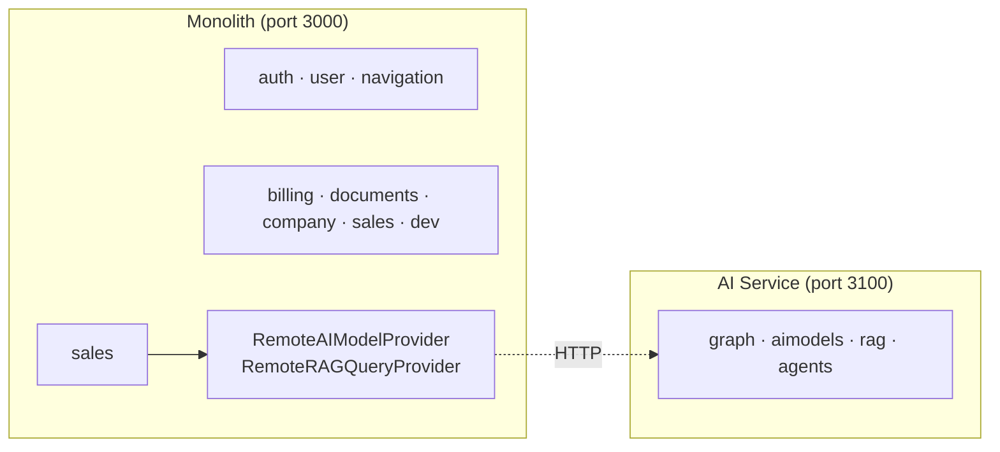

# AI Sidecar Split

The AI module chain (`graph`, `aimodels`, `rag`, `agents`) can optionally run as a **standalone sidecar service** (`cmd/ai-service/`) separate from the monolith. Controlled by the `AI_SERVICE_URL` env var on the monolith:

- **Empty (default)** — all modules run in-process in the monolith. No change from baseline.
- **Set** (e.g., `http://orkestra-ai:3100`) — the monolith skips registering `graph`/`aimodels`/`rag`/`agents` and instead registers `RemoteAIModelProvider` + `RemoteRAGQueryProvider` (HTTP clients) under the same `ServiceRegistry` keys. Consumer modules like `sales` use the same `GetTyped` pattern — zero code changes.

## How the split works



## Design constraints

- Both binaries live in the **same Go module** (`backend/`) — no code duplication, shared `internal/` packages.
- The AI service uses `JWTValidator` (public key only) instead of `AuthMiddleware` (which depends on the auth module). Both satisfy `module.RoleMiddleware`.
- Internal API endpoints (`/v1/internal/*`) are the service-to-service contract. They serialize the `iface.AIModelProvider` and `iface.RAGQueryProvider` method calls as HTTP request/response.
- Streaming (`/v1/rag/query/stream`) goes **directly** from frontend → AI service, never proxied through the monolith.
- The feature flag is fully backward compatible and K8s-ready (service DNS, Ingress routing, separate `Deployment` with independent scaling).

## Running split mode in dev

```bash
cd docker
docker compose -f docker-compose.infra.yml up -d
AI_SERVICE_URL=http://orkestra-ai-dev:3100 \
  docker compose -f docker-compose.dev.yml --env-file .env up -d
docker compose -f docker-compose.ai-sidecar.yml --env-file .env up -d
```
