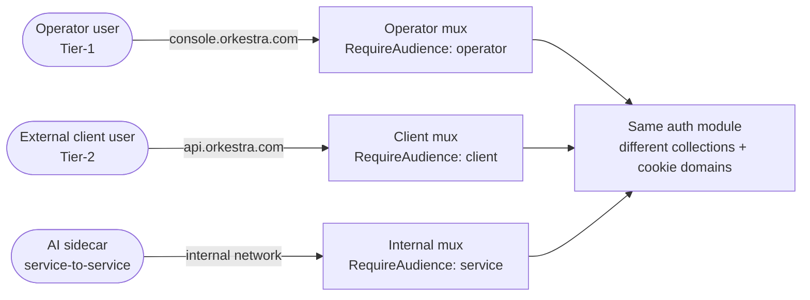

# Authentication Flow

This is the cross-cutting walkthrough of how a request becomes an authenticated identity in Orkestra. It does **not** enumerate every endpoint — for the full per-route table see the [auth module reference in the monorepo](https://github.com/orkestra-cc/orkestra/blob/main/backend/internal/core/auth/CLAUDE.md). Read this page when you want the *story*; read the module CLAUDE.md when you want the *contract*.

## 1. Audience model

Orkestra serves two human-facing audiences from one Go binary, dispatched by `Host` header. A third audience exists for service-to-service calls and is never exposed by ingress.

| Audience   | Host (prod)            | JWT `aud`  | What lives here                                                                          |
| ---------- | ---------------------- | ---------- | ---------------------------------------------------------------------------------------- |
| `operator` | `console.orkestra.com` | `operator` | Tier-1 operator dashboard — module admin, system config, internal billing/SDI, dev tooling |
| `client`   | `api.orkestra.com`     | `client`   | Tier-2 external client tenants — onboarding, subscriptions, payments                      |
| `service`  | _(internal docker net)_ | `service`  | AI sidecar `/v1/internal/*` — never published by ingress                                  |



Each public audience has its own `chi.Mux`, its own `huma.API`, its own CORS allowlist, its own rate-limit policy, and its own `RequireAudience` middleware. **A token issued for one audience is rejected at the edge of the other** with `401 audience_mismatch` — this is defense in depth above per-route RBAC.

In dev (`ENV=development`) the host mux falls through to the operator mux when the `Host` header is unrecognised, so `curl http://localhost:3000/health` keeps working without `/etc/hosts` gymnastics. In staging/prod, an unmatched `Host` returns `421 Misdirected Request`.

## 2. Two login paths, one module

Every auth route is mounted twice — once under `/v1/auth/operator/...` (operator host) and once under `/v1/auth/client/...` (client host) — by the same `auth` module. The two mounts share the password service code, MFA logic, and OAuth provider catalogue, but each is wired to its own:

- **User collection** — `operator_users` vs `client_users`
- **Refresh-token / session / OAuth-link / MFA / email-token collections** — `operator_*` vs `client_*`
- **JWT service** — both use the same RS256 key pair, but stamp `aud=operator` / `aud=client` at issuance
- **Refresh-cookie `Domain` attribute** — `console.orkestra.com` vs `api.orkestra.com` (see §6)

Use `{tier}` below as a stand-in for `operator` or `client`.

### Public endpoints (no bearer required)

```
POST  /v1/auth/{tier}/register              email + password signup
POST  /v1/auth/{tier}/login                 password login → access token + refresh cookie
POST  /v1/auth/{tier}/verify-email          consume verification token
POST  /v1/auth/{tier}/verify-email/resend   request a fresh verification email
POST  /v1/auth/{tier}/forgot-password       issue reset token via email
POST  /v1/auth/{tier}/reset-password        consume reset token, rotate password
POST  /v1/auth/{tier}/refresh               refresh via header-supplied token
POST  /v1/auth/{tier}/refresh-cookie        refresh via HttpOnly cookie
POST  /v1/auth/{tier}/logout                revoke refresh + invalidate session

GET   /v1/auth/{tier}/providers             list OAuth providers configured for this audience
POST  /v1/auth/{tier}/oauth/login           start a web OAuth flow
POST  /v1/auth/{tier}/google/mobile         exchange a Google ID token for an Orkestra session
POST  /v1/auth/{tier}/apple/mobile          exchange an Apple ID token for an Orkestra session
```

### OAuth callbacks (single shared mount, dispatched by tier)

```
GET   /v1/auth/oauth/google/callback        single redirect URI per provider — dispatched
GET   /v1/auth/oauth/discord/callback       to operator or client by signed state JWT
POST  /v1/auth/oauth/apple/callback         (Apple form-post)
GET   /v1/auth/oauth/github/callback
GET   /v1/auth/session                      web post-OAuth: read fresh access token via cookie
```

These four callbacks are mounted **only on the operator host**. The OAuth `state` parameter is a signed HS256 JWT carrying `{tier, csrf, exp}`; the dispatcher decodes the tier and forwards to the matching tier's `AuthHandler` so token issuance, cookie domain, and frontend-redirect URL all read from the audience-correct config. See §5 for the full flow.

### Protected endpoints (bearer required)

```
GET   /v1/auth/{tier}/me                    return the current user
POST  /v1/auth/{tier}/change-password       requires current password
POST  /v1/auth/{tier}/mfa/...               TOTP enrol / verify / remove
POST  /v1/auth/{tier}/mfa/webauthn/...      passkey enrol / verify / remove
POST  /v1/auth/{tier}/me/devices/trust      mark current device as trusted (skip MFA prompts)
```

Plus admin-only operator-side `POST /v1/admin/users/{id}/mfa/reset` (operator tier only — admin is operator-tier by definition).

## 3. Token shape

All access and refresh tokens are RS256-signed JWTs from the same key pair (`AUTH_JWT_PRIVATE_KEY` / `AUTH_JWT_PUBLIC_KEY`). The `aud` claim is **mandatory** at validation time — a token without `aud`, or with the wrong `aud` for the mux it lands on, is rejected.

### Access token claims

```json
{
  "sub": "<user-uuid>",
  "email": "user@example.com",
  "srole": "administrator",
  "type": "access",
  "iss": "orkestra",
  "aud": "operator",
  "iat": 1730000000,
  "exp": 1730000900,
  "sid": "<session-uuid>",
  "did": "<device-id>",
  "memberships": [
    { "orgId": "...", "orgName": "...", "orgSlug": "...", "roles": ["org_admin"] }
  ],
  "amr": ["pwd", "otp"],
  "last_otp_at": 1730000800
}
```

- **`srole`** is the global system role (`super_admin` > `administrator` > `developer` > `manager` > `operator` > `guest`). Memberships carry org-scoped roles. **Permissions are not embedded** — they are resolved per-request by middleware via `authz.HasPermission`.
- **`amr`** (RFC 8176) records the authentication method(s) used. `pwd` for password login, `oauth` for OAuth, `otp` after MFA verification, `webauthn` after a passkey assertion, `reauth` after a successful password reconfirm via `/me/password-confirm`. `last_otp_at` lets `RequireStepUp(maxAge)` middleware demand a fresh MFA proof (or fresh reconfirm) for catastrophic actions.
- **`sid`** is the session UUID. Logout / change-password add it to a Redis-backed revocation set so the access token stops working instantly without waiting for the TTL.

### Refresh token

Same shape, `type: "refresh"`, longer expiry (`JWT_REFRESH_TOKEN_EXPIRY`, default 30d). Refresh tokens carry the **same `aud` claim** as the access token they paired with, so a refresh token issued for the operator host cannot be redeemed on the client host.

Refresh tokens rotate on every use with family-detection: each login mints a new `FamilyID`, every rotation preserves it via an atomic CAS, and replaying a rotated token revokes the entire family with `revokedReason="replay_detected"`.

## 4. Email + password flow

Argon2id (OWASP 2025 params: 19 MiB, 2 iterations, 1 lane, 16-byte salt, 32-byte output) in PHC format. The password service exposes `NeedsRehash(encoded)` and the login handler transparently rehashes on success when the stored hash uses weaker parameters than the current default.

Policy enforced on every new password:

- Minimum 10 characters (NIST SP 800-63B-4)
- Best-effort HaveIBeenPwned k-anonymity check (only the first 5 hex chars of the SHA-1 hash leave the server)
- No rotation requirement, no composition rules

When `GetUserForAuth` finds no user, the password service runs `Verify` against a precomputed dummy hash so wall-clock time matches the "user found, wrong password" path — defeats timing-based enumeration.

### Registration

1. `POST /v1/auth/{tier}/register` with `{email, password, fullName}`.
2. Backend validates policy + HIBP, hashes with argon2id, writes to `{tier}_users`.
3. **First-user bootstrap**: if `GetUserCount(ctx, nil) == 0` the new account gets `super_admin`. Subsequent accounts default to `operator`.
4. A 32-byte random verification token is generated, SHA-256-hashed, stored in `{tier}_email_tokens` with a 24h TTL, and the raw token is delivered by `notifier.SendTemplated("auth.verify_email", ...)`.
5. If `AUTH_REQUIRE_EMAIL_VERIFICATION=true` (production default) and the notifier is missing or unconfigured, registration returns `503 Service Unavailable`. If `false` (dev default), the account is auto-verified and no email is sent.

### Login

1. `POST /v1/auth/{tier}/login` with `{email, password}`.
2. Two rate-limit buckets (per IP and per email, both 3 attempts / 15 min) gate the request.
3. After 5 consecutive misses, `User.LockedUntil` is set 15 minutes in the future and the handler short-circuits with `429`.
4. On success: failed counter cleared, hash rehashed if needed, `AuthSessionDoc{LoginMethod="password"}` written for audit, **state machine forks on MFA policy** (see §7), tokens issued, refresh cookie set on the audience-correct domain.

### Verification + reset

Both flows share `{tier}_email_tokens` (TTL: 24h verification, 30 min reset; both single-use, SHA-256 hashed at rest, `expiresAt` TTL index sweeps expired rows). Reset atomically updates `PasswordHash`, clears the failed-login counter, marks the token used, and revokes every refresh token for the user — the user must sign in from scratch on every device.

## 5. OAuth 2.1 flow

Provider configuration (client IDs / secrets / redirect URIs / mobile-platform IDs) is admin-managed in `module_configs` and resolved per-request via `OAuthConfigResolver` (Redis-cached, 30s TTL). Env vars are seed-only — once the document exists, editing the env has no effect without a wipe.

### Web flow

1. Frontend calls `POST /v1/auth/{tier}/oauth/login` with `{provider, redirectUri}`. Backend constructs a signed HS256 state JWT `{tier, csrf, exp}` (HMAC secret deterministically derived from the JWT private key — every replica agrees without an env var, rotates implicitly when JWT keys rotate) and stores per-flow side data (`provider`, `redirectUri`, `deviceInfo`, `securityContext`) in Redis keyed by the CSRF nonce, with a 10-minute TTL. Returns `{authorizeUrl}`.
2. Frontend redirects the user to the provider.
3. Provider redirects back to **the single shared callback URL** registered with each provider (`/v1/auth/oauth/{provider}/callback`, mounted on the operator mux only — one redirect URI per provider in IdP config). The callback parses the state JWT, cross-checks `state.tier == redis.tier`, then dispatches to the matching tier's `AuthHandler` via `tierDispatch[state.tier]`. Empty / unknown tier falls through to the legacy operator handler so any pre-cutover flows still resolve.
4. The dispatched-to handler exchanges the code with the provider, fetches user info, runs `HandleOAuthCallbackWithLinking` (find-or-create by `(provider, providerId)`, link existing email accounts), mints a token pair stamped with the audience's `aud`, and **redirects the user to the frontend with no token in the URL** — only `success=true&user_id=...&email=...&provider=...`.
5. Frontend calls `GET /v1/auth/session` (operator-only mount, post-OAuth cookie-based bootstrap) to exchange the refresh-cookie for a fresh access token + user payload.

The signed state + CSRF-keyed Redis row is what defeats both classic CSRF (state forge) and tier confusion (state replay across audiences).

### Mobile flow

Mobile apps go through the platform's native OAuth SDK (Google Sign-In, Sign in with Apple) and POST the resulting **ID token** to `POST /v1/auth/{tier}/{google|apple}/mobile`. Backend validates the ID token signature against the provider's published JWKs, checks audience (`MobileAudience(provider, platform)` resolves to the platform-specific client ID, falling back to the web client ID for unknown platforms), runs the same find-or-create + token-issuance path as web, and returns the token pair in the response body. No state JWT is needed — the ID token *is* the proof.

The mobile entry points are tier-aware just like the web ones, so a mobile client can target either audience by hitting the matching prefix.

## 6. Refresh + cookie scope

The refresh token is delivered as an `HttpOnly; Secure; SameSite=Lax` cookie on every successful auth response. The cookie's `Domain` attribute is **scoped to the audience**:

| Mux                    | `Set-Cookie: orkestra_cookie=...; Domain=`                       |
| ---------------------- | ---------------------------------------------------------------- |
| Operator (`console.*`) | `OPERATOR_COOKIE_DOMAIN` (default dev: `console.localhost`)      |
| Client (`api.*`)       | `CLIENT_COOKIE_DOMAIN`   (default dev: `api.localhost`)          |

Empty per-tier values fall back to the legacy `COOKIE_DOMAIN` for single-host deployments.

:::warning
In production-like envs operators MUST set both explicitly — leaving them empty defeats the host split because the legacy `COOKIE_DOMAIN` spans both audiences.
:::

Refresh cookies are scoped narrowly enough that the browser won't send a `console.*` refresh cookie on an `api.*` request and vice versa, so cross-audience replay is structurally impossible at the cookie layer in addition to being rejected at the JWT layer.

### Silent refresh

When an authenticated request arrives with an expired access token but a valid refresh cookie, `AuthMiddleware` rotates transparently: it calls `RefreshTokensWithRiskAssessment`, sets a new refresh cookie scoped to the request's audience (looked up via `AudienceFromContext` → `cookieDomainForAudience`), returns the new access token in `X-New-Access-Token` + `X-Token-Refreshed: true` response headers, and serves the original request as if the user had presented the new access token to begin with.

Manual refresh is also exposed at `POST /v1/auth/{tier}/refresh` (header-supplied refresh token) and `POST /v1/auth/{tier}/refresh-cookie` (HttpOnly cookie path).

## 7. MFA + WebAuthn

MFA is **mandatory for privileged roles** — `super_admin`, `administrator`, and any membership carrying `org_owner` / `org_admin`. `developer` is intentionally excluded (its prod downgrade to read-only covers the risk).

A privileged user logging in without an MFA factor has `User.MFAGraceStartedAt` stamped on that login (idempotent via `UserProvider.StartMFAGraceIfUnset`). They get **7 days** to enrol — past the window, login returns `403 mfa_enrollment_required`. Granting a privileged role via `authz.CreateBinding` also eagerly starts the clock so the 7 days begin at promotion, not next login.

### Login state machine

`PasswordAuthService.completeLogin` (and the OAuth equivalent `AuthService.evaluateMFAForOAuth`) forks on the user's privilege level + MFA state:

| State                                                | Response                                                                                                                                                                                                                       |
| ---------------------------------------------------- | ------------------------------------------------------------------------------------------------------------------------------------------------------------------------------------------------------------------------------ |
| Non-privileged                                       | Full token pair, `amr=["pwd"]` (or `["oauth"]`)                                                                                                                                                                                |
| Privileged + MFA factor enrolled                     | Partial 200 `{requiresMfa: true, mfaToken: <challengeId>, webauthnAvailable: bool}` — no access token. Client must call `/v1/auth/{tier}/mfa/login/verify` (TOTP / backup code) or `/v1/auth/{tier}/mfa/webauthn/login/{begin,finish}` (passkey) to get the real token pair |
| Privileged + no factor + within 7-day grace          | Full token pair + `mfaEnrollmentRequired: true` + `mfaGraceExpiresAt`                                                                                                                                                          |
| Privileged + no factor + grace expired               | `403 mfa_enrollment_required`                                                                                                                                                                                                  |

### Step-up gate

`RoleMiddleware.RequireStepUp(maxAge)` is a stricter variant applied to catastrophic / irreversible actions (`POST /v1/auth/{tier}/me/mfa/remove`, `POST /v1/admin/users/{id}/mfa/reset`, self-service OAuth link/unlink, session revoke / revoke-all, backup-code regeneration). It checks both that `amr` contains an MFA-or-reauth marker **AND** that `last_otp_at` is within `maxAge` of now — a session-long MFA proof is not enough.

The middleware emits **three** distinct envelopes so the SPA can pick the right modal without a second round-trip:

1. **`401 step_up_required`** — the user has at least one MFA factor enrolled; ask for an OTP / passkey. The global `StepUpModal` drives the user through `/v1/auth/{tier}/mfa/verify` (or WebAuthn assertion) and replays the original request.
2. **`401 password_confirm_required`** — the user has **no** MFA factor enrolled AND the policy doesn't require them to. The `PasswordConfirmModal` posts the password to `POST /v1/auth/{tier}/me/password-confirm`; the response mints a fresh access token with `amr += "reauth"` + `last_otp_at = now`, and `RequireStepUp` accepts the `"reauth"` marker on the replay.
3. **`403 mfa_enrollment_required`** — the user's role obligates MFA but they haven't enrolled. No bypass — the SPA nudges them to enroll a factor first.

The enrollment branching is driven by `MFAEnrollmentLookup` (per-tier `MFAFactorRepository` lookups for TOTP + WebAuthn) and the live `AuthPolicyService.MFARequired` check. Any lookup error fails closed to `step_up_required` — a degraded Mongo must never silently weaken the gate.

### TOTP details

- Secrets AES-256-GCM-encrypted with `MFA_SECRET_ENCRYPTION_KEY` (falls back to `OAUTH_TOKEN_ENCRYPTION_KEY` for single-key dev setups). Backup codes argon2id-hashed via the password service.
- Replay guard: `MFAFactorDoc.LastUsedStep` advances via an atomic CAS in the repo, so a captured code cannot be used twice within its 30-second window — same caller or concurrent.
- Challenge state lives in Redis under `mfa:challenge:<uuid>` with a 5-minute TTL; the row is deleted after 5 failed verifications.

### WebAuthn / passkeys

The `webauthn` factor row carries an embedded `webauthnCredentials[]` array (one row per user with `type=webauthn`; the `(userUuid, type)` unique index naturally allows a user to enrol both TOTP and passkeys). Library: `github.com/go-webauthn/webauthn`. Configured via `WEBAUTHN_RP_ID` (eTLD+1 host, no scheme/port) + `WEBAUTHN_RP_ORIGINS` (comma-separated full URLs). Both env vars are optional — if either is missing the module derives them from `FRONTEND_URL`. If neither resolves, WebAuthn is disabled and the endpoints don't mount.

Login / step-up via passkey sets `amr=[..., "otp", "webauthn"]` so `RequireStepUp` accepts the proof. The partial-login response carries `webauthnAvailable: bool` so the verify page can offer the passkey button alongside the TOTP code field.

The current flow requires password login first, then offers passkey as the second factor. Full passwordless (discoverable / usernameless) login would need a `BeginDiscoverableLogin` entry point and is not built yet.

## 8. Session revocation

Logout, change-password, and admin actions populate a Redis-backed set at `auth:revoked:session:<sid>` with the reason string. Both `AuthMiddleware` (monolith) and `JWTValidator` (AI sidecar) check it on every authenticated request — revocation takes effect within milliseconds instead of waiting for the access-token TTL. Entries auto-expire after `access TTL + 1min`. The revocation check **fails open on Redis errors** — a degraded Redis must not lock every user out.

`logout` invalidates the current sid only; logout-all-devices currently relies on revoking every refresh token in the user's family (per-user generation counter is a follow-up).

## 9. RBAC

Roles, in descending privilege:

| Role            | Scope                                                                                  |
| --------------- | -------------------------------------------------------------------------------------- |
| `super_admin`   | Full system access. Assigned to the first user on a fresh install via bootstrap heuristic |
| `administrator` | Module admin, system config, billing, admin endpoints                                  |
| `developer`     | Dev tooling, internal endpoints. Prod downgrade keeps read-only access                 |
| `manager`       | Team / operational oversight                                                           |
| `operator`      | Default for new users post-bootstrap                                                   |
| `guest`         | Read-only                                                                              |

Roles are coarse-grained and embedded in the JWT (`srole` claim + `memberships[].roles`); **permissions are fine-grained and resolved per-request** by middleware via `authz.HasPermission`. This is the most important thing to remember about the authentication architecture: revocation must be instant, so permissions are never cached in tokens.

Standard middleware:

- `RequireAuth` — bearer token required; populates user + tenant context
- `RequireGlobal()` — bearer required, no org context (self-service flows)
- `RequireSystemPermission("...")` — fine-grained permission check via authz
- `RequireMFA()` — applied to authz role+binding mutations, tenant scoped mutations, module config writes; demands a recent `amr` containing an MFA marker
- `RequireStepUp(maxAge)` — strict variant for catastrophic actions (see §7)

## 10. Dev tooling

`scripts/devtoken.sh` mints synthetic-user JWTs for local testing without touching the database. Disabled in production.

```bash
./scripts/devtoken.sh administrator                       # default — aud=operator
./scripts/devtoken.sh administrator --audience client     # aud=client (api.* surface)
./scripts/devtoken.sh admin --quiet                       # token only, for piping
./scripts/devtoken.sh manager --curl                      # ready-to-use curl command
./scripts/devtoken.sh operator --expiry 1h                # custom expiry (max 24h)
```

The audience flag is the difference between "I can hit `console.*`" and "I can hit `api.*`" — without it, dev tokens default to operator and the client mux's `RequireAudience` gate rejects them with `401 audience_mismatch`.

## 11. Where to look

| Question                                          | Source of truth                                                                                                                                                  |
| ------------------------------------------------- | ---------------------------------------------------------------------------------------------------------------------------------------------------------------- |
| What endpoints exist?                             | The [API Reference](/api) on this site (auto-generated from the canonical spec), or the [auth module CLAUDE.md](https://github.com/orkestra-cc/orkestra/blob/main/backend/internal/core/auth/CLAUDE.md) for prose context |
| Why the audience split?                           | [ADR-0003 in the monorepo](https://github.com/orkestra-cc/orkestra/blob/main/docs/adr/0003-three-audience-host-split.md) (will sync to /adrs when tagged `public: true`) |
| What env vars does auth read?                     | [auth module CLAUDE.md → Runtime configuration](https://github.com/orkestra-cc/orkestra/blob/main/backend/internal/core/auth/CLAUDE.md#runtime-configuration)    |
| How are cookie domains configured per audience?   | [docker/CLAUDE.md → Host split](https://github.com/orkestra-cc/orkestra/blob/main/docker/CLAUDE.md)                                                              |
| What's the JWT validator doing under the hood?    | `backend/internal/core/auth/services/jwt_service.go` (`ValidateAccessToken`) and `backend/internal/shared/middleware/audience.go` (`RequireAudience`)            |
