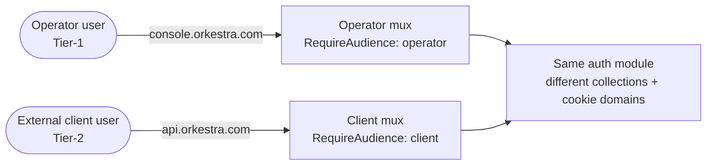

# Authentication Flow

This is the cross-cutting walkthrough of how a request becomes an authenticated identity in Orkestra. It does **not** enumerate every endpoint — for the full per-route table see the [auth module reference in the monorepo](https://github.com/orkestra-cc/orkestra/blob/main/backend/internal/core/auth/CLAUDE.md). Read this page when you want the *story*; read the module CLAUDE.md when you want the *contract*.

## 1. Audience model

Orkestra serves two human-facing audiences from one Go binary, dispatched by `Host` header, plus one machine audience that rides on the operator host.

| Audience   | Host (prod)            | JWT `aud`  | What lives here                                                                          |
| ---------- | ---------------------- | ---------- | ---------------------------------------------------------------------------------------- |
| `operator` | `console.orkestra.com` | `operator` | Tier-1 operator dashboard — module admin, system config, dev tooling                     |
| `client`   | `api.orkestra.com`     | `client`   | Tier-2 external client tenants — onboarding, account                                     |
| `service`  | `console.orkestra.com` | `service`  | Machine callers holding service-account credentials — see [§10](#10-machine-callers-service-accounts)      |


```mermaid
flowchart LR
  user1(["Operator user<br/>Tier-1"]) -- console.orkestra.com --> opMux[Operator mux<br/>RequireAudience: operator]
  user2(["External client user<br/>Tier-2"]) -- api.orkestra.com --> clMux[Client mux<br/>RequireAudience: client]
  opMux --> handlers[Same auth module<br/>different collections + cookie domains]
  clMux --> handlers
```

Each public audience has its own `chi.Mux`, its own `huma.API`, its own CORS allowlist, its own rate-limit policy, and its own `RequireAudience` middleware. **A token issued for one audience is rejected at the edge of the other** with `401 audience_mismatch` — this is defense in depth above per-route RBAC.

`RequireAudience` is a **set-membership** check, not an exact match: the operator mux accepts `operator, service` while the client mux accepts `client` only. That is the whole mechanism confining machine callers to Tier-1.

In dev (`ENV=development`) the host mux falls through to the operator mux when the `Host` header is unrecognised, so `curl http://localhost:3000/health` keeps working without `/etc/hosts` gymnastics. In staging/prod, an unmatched `Host` returns `421 Misdirected Request`.

## 2. Two login paths, one module

Every auth route is mounted twice — once under `/v1/auth/operator/...` (operator host) and once under `/v1/auth/client/...` (client host) — by the same `auth` module. The two mounts share the password service code, MFA logic, and OAuth provider catalogue, but each is wired to its own:

- **User collection** — `operator_users` vs `client_users`
- **Refresh-token / session / OAuth-link / MFA / email-token collections** — `operator_*` vs `client_*`
- **JWT service** — both use the same RS256 key pair, but stamp `aud=operator` / `aud=client` at issuance
- **Refresh-cookie `Domain` attribute** — `console.orkestra.com` vs `api.orkestra.com` (see §6)

Use `{tier}` below as a stand-in for `operator` or `client`.

### Public endpoints (no bearer required)

```
POST  /v1/auth/{tier}/register              email + password signup
POST  /v1/auth/{tier}/login                 password login → access token + refresh cookie
POST  /v1/auth/{tier}/verify-email          consume verification token
POST  /v1/auth/{tier}/verify-email/resend   request a fresh verification email
POST  /v1/auth/{tier}/forgot-password       issue reset token via email
POST  /v1/auth/{tier}/reset-password        consume reset token, rotate password
POST  /v1/auth/{tier}/refresh               refresh via header-supplied token
POST  /v1/auth/{tier}/refresh-cookie        refresh via HttpOnly cookie
POST  /v1/auth/{tier}/logout                revoke refresh + invalidate session

GET   /v1/auth/{tier}/policy                public slice of admin-managed auth policy the login/signup pages render against
GET   /v1/auth/{tier}/providers             list OAuth providers USABLE on this audience (toggle on + structurally complete; 503 when the auth document cannot be read)
POST  /v1/auth/{tier}/oauth/login           start a web OAuth flow
GET   /v1/auth/client/oauth/complete        (client host only) completes a relayed client-tier web login
POST  /v1/auth/{tier}/google/mobile         exchange a Google ID token for an Orkestra session
POST  /v1/auth/{tier}/apple/mobile          exchange an Apple ID token for an Orkestra session
```

### OAuth callbacks (single shared mount, dispatched by tier)

```
GET   /v1/auth/oauth/google/callback        single redirect URI per provider — dispatched
GET   /v1/auth/oauth/discord/callback       to operator or client by signed state JWT
POST  /v1/auth/oauth/apple/callback         (Apple form-post)
GET   /v1/auth/oauth/github/callback
GET   /v1/auth/session                      web post-OAuth: read fresh access token via cookie
```

These four callbacks are mounted **only on the operator host**. The OAuth `state` parameter is a signed HS256 JWT carrying `{tier, csrf, exp}`; the dispatcher decodes the tier and forwards to the matching tier's `AuthHandler` so token issuance, cookie domain, and frontend-redirect URL all read from the audience-correct config. See §5 for the full flow.

### Protected endpoints (bearer required)

```
GET   /v1/auth/{tier}/me                    return the current user
POST  /v1/auth/{tier}/change-password       requires current password
POST  /v1/auth/{tier}/mfa/...               TOTP enrol / verify / remove
POST  /v1/auth/{tier}/mfa/webauthn/...      passkey enrol / verify / remove
POST  /v1/auth/{tier}/me/devices/trust      mark current device as trusted (skip MFA prompts)
```

Plus admin-only operator-side `POST /v1/admin/users/{id}/mfa/reset` (operator tier only — admin is operator-tier by definition).

## 3. Token shape

All access and refresh tokens are RS256-signed JWTs from the same key pair (`AUTH_JWT_PRIVATE_KEY` / `AUTH_JWT_PUBLIC_KEY`). The `aud` claim is **mandatory** at validation time — a token without `aud`, or with the wrong `aud` for the mux it lands on, is rejected.

### Access token claims

```json
{
  "sub": "<user-uuid>",
  "email": "user@example.com",
  "srole": "administrator",
  "type": "access",
  "iss": "orkestra",
  "aud": "operator",
  "iat": 1730000000,
  "exp": 1730000900,
  "sid": "<session-uuid>",
  "did": "<device-id>",
  "memberships": [
    { "orgId": "...", "orgName": "...", "orgSlug": "...", "roles": ["org_admin"] }
  ],
  "dtid": "<tenant-fallback-uuid>",
  "acting_tenant_id": "<tenant-fallback-uuid>",
  "acting_tenant_kind": "internal",
  "amr": ["pwd", "otp"],
  "last_otp_at": 1730000800
}
```

- **`srole`** is the global system role (`super_admin` > `administrator` > `developer` > `manager` > `operator` > `guest`). Memberships carry org-scoped roles. **Permissions are not embedded** — they are resolved per-request by middleware via `authz.HasPermission`. (The wire-compact `mbr` claim's membership objects use `{tid, k, r}`, not the expanded `{orgId, orgName, orgSlug, roles}` shown above for readability.)
- **`dtid`** ("default tenant id" — the pre-rename name) carries `TenantFallbackID`: the tenant this token falls back to when nothing more specific resolves the current tenant (see [Tenant resolution](#tenant-resolution-and-the-fallback-claim) below). The key stays `dtid` on the wire for backward compatibility with already-issued tokens; only the Go field was renamed.
- **`acting_tenant_id`** / **`acting_tenant_kind`** are the tenant (and its kind, `internal`/`external`) this specific token is minted to act in. For an operator-audience token they start out equal to `dtid`/its kind and can be overridden per-request by `X-Tenant-ID`; a client-portal token pins them for the token's whole lifetime.
- **`amr`** (RFC 8176) records the authentication method(s) used. `pwd` for password login, `oauth` for OAuth, `otp` after MFA verification, `webauthn` after a passkey assertion, `reauth` after a successful password reconfirm via `/me/password-confirm`. `last_otp_at` lets `RequireStepUp(maxAge)` middleware demand a fresh MFA proof (or fresh reconfirm) for catastrophic actions.
- **`sid`** is the canonical session UUID. One random UUID is created before either JWT is signed; the access JWT `sid`, refresh JWT `sid`, refresh-token row, session document, and token response match. Refresh rotation and MFA/WebAuthn completion preserve it. Logout / change-password add it to a Redis-backed revocation set so the access token stops working instantly without waiting for the TTL.

### Tenant resolution and the fallback claim

Every protected request resolves **one current tenant** from the token plus, optionally, an `X-Tenant-ID` header. `shared/middleware/auth.go::resolveCurrentTenant` applies these rules in order — unchanged by the platform-default work below:

1. **Header override** — `X-Tenant-ID`, for **operator-audience tokens only**, when it names a tenant the caller is a member of. This is the operator org switcher.
2. **Acting** — `acting_tenant_id` / `acting_tenant_kind`, when the issuer set them. A client-portal token is minted pinned to one tenant, so the header can never move it.
3. **Header** — `X-Tenant-ID` again, this time for any audience, when the caller is a member of the named tenant.
4. **Fallback** — `dtid` (`TenantFallbackID`).

The platform default never appears in this list directly — it only ever influences step 4, and only at **issuance time**, not at resolution time. Middleware itself never reads the platform-default pointer.

**How `dtid` is chosen at issuance** (operator-audience tokens only; `auth/services/jwt_service.go::loadMemberships`):

1. The **platform default Tier-1 tenant** (a single global pointer the tenant module owns, seeded during first-install setup and transferable by an admin — see the [tenant module page](/modules/core/tenant#platform-default-tenant)), when it names one of the caller's own valid memberships. This grants nothing by itself: the tenant still has to already be a membership the caller holds, and the header override (rule 1) and acting-tenant pin (rule 2) above still take precedence at resolution time.
2. Otherwise, the caller's first **owned** membership, in a deterministic order (memberships sorted by join date, then tenant id, so two tokens minted back-to-back for the same user always agree).
3. Otherwise, the caller's first membership in that same order.

A provider hiccup — the platform-default pointer being unreadable, or nothing assigned yet — never blocks login: selection quietly falls through to rule 2. And because `dtid` is baked into the signed token at mint time, **transferring the platform default does not touch tokens already issued** — they keep their old fallback until they're refreshed, re-authenticated, or expire; only a freshly minted or refreshed token picks up the new default. Client-audience (Tier-2) tokens never consult the platform default at all — their acting tenant is pinned by the issuer, and Tier-1's internal-only pointer has no business influencing a Tier-2 session.

### Refresh token

Same shape, `type: "refresh"`, longer expiry (`JWT_REFRESH_TOKEN_EXPIRY`, default `7d`). Because rotation rewrites the expiry on every use, this value is the session's **idle** timeout; its absolute lifetime is bounded separately by `sessionAbsoluteTTL` (see [ADR-0017](/adrs/session-lifetime-and-token-retention)). Refresh tokens carry the **same `aud` claim** as the access token they paired with, so a refresh token issued for the operator host cannot be redeemed on the client host.

Refresh tokens rotate on every use with family detection: each login mints a new `FamilyID`, every rotation preserves it via an atomic CAS, and replaying a rotated token revokes the entire family with `revokedReason="replay_detected"`. A rotation lost to a *concurrent* caller is not a replay: within a 10-second grace window, and only while the family carries no revocation fence, the loser gets **409** `refresh_rotation_raced` — no family revocation and no credentials — and retries once with the successor cookie its sibling left in the jar. This is what keeps a browser with several console tabs open from signing itself out every time the access token expires; the operator console also serialises rotation across tabs with a Web Lock. A **rotation** that fails for an *infrastructure* reason — an unreachable token or user store, a signing failure, a failed rotating write, or a cookie candidate the store could not classify at all — answers **503 `refresh_lookup_unavailable`**, never 401: reporting an outage as an authentication failure is what trains a client to discard a session that is still perfectly valid. A genuinely deleted account is still a 401, so a dead session can still end. The **read-only mint** `GET /v1/auth/session` performs after classifying the cookie (`MintAccessTokenFromRefresh`) answers the same way, on its own token lookup, its own user lookup and its own signing call. That mint reads the store a *second* time, so a blip opening between the classification step and the mint used to answer session bootstrap with a codeless 401. `POST /v1/auth/{tier}/refresh-cookie`, `POST /v1/auth/{tier}/refresh` and `GET /v1/auth/session` are therefore each covered end to end. A durable tier-scoped family-revocation record fences a successor that races replay revocation; it cannot escape as active. No row is deleted while its token could still pass temporal validation, regardless of revocation state — an unexpired rotated row is exactly what replay detection matches a reused token against; once `expiresAt` is past, replaying it cannot mint credentials and the row may be swept ([ADR-0017](/adrs/session-lifetime-and-token-retention), D7).

## 4. Email + password flow

Argon2id (OWASP 2025 params: 19 MiB, 2 iterations, 1 lane, 16-byte salt, 32-byte output) in PHC format. The password service exposes `NeedsRehash(encoded)` and the login handler transparently rehashes on success when the stored hash uses weaker parameters than the current default.

Policy enforced on every new password:

- Minimum 10 characters (NIST SP 800-63B-4)
- Best-effort HaveIBeenPwned k-anonymity check (only the first 5 hex chars of the SHA-1 hash leave the server)
- No rotation requirement, no composition rules

When `GetUserForAuth` finds no user, the password service runs `Verify` against a precomputed dummy hash so wall-clock time matches the "user found, wrong password" path — defeats timing-based enumeration.

### Registration

1. `POST /v1/auth/{tier}/register` with `{email, password, fullName}`.
2. Backend validates policy + HIBP, hashes with argon2id, writes to `{tier}_users`.
3. **First-user bootstrap**: if `GetUserCount(ctx, nil) == 0` the new account gets `super_admin`. Subsequent accounts default to `operator`.
4. A 32-byte random verification token is generated, SHA-256-hashed, stored in `{tier}_email_tokens` with a 24h TTL, and the raw token is delivered by `notifier.SendTemplated("auth.verify_email", ...)`.
5. If `AUTH_REQUIRE_EMAIL_VERIFICATION=true` (production default) and the notifier is missing or unconfigured, registration returns `503 Service Unavailable`. If `false` (dev default), the account is auto-verified and no email is sent.

### Login

1. `POST /v1/auth/{tier}/login` with `{email, password}`.
2. **Is the password still an accepted method on this surface?** After the `loginEnabled…` maintenance kill switch and **before anything reads the account**, the handler evaluates the per-surface `passwordLoginEnabled{Admin,Client}` policy. Off → `403 auth.password_login_disabled`; unreadable or malformed → `503 auth.policy_unavailable` (the read is strict and fails closed — an outage never re-opens the method). Because it sits ahead of `GetUserForAuth`, the rate-limit buckets, the lockout counter and the audit trail see nothing, and every address — registered or not — gets the identical answer. On the **operator** surface only, a boot-time break-glass variable can convert a stored `false` or a failed read into a rescued login, which is audited; see [SSO-only surface](/modules/core/auth#sso-only-surface).
3. Two rate-limit buckets (per IP and per email, both 3 attempts / 15 min) gate the request.
4. After 5 consecutive misses, `User.LockedUntil` is set 15 minutes in the future and the handler short-circuits with `429`.
5. On success: failed counter cleared, hash rehashed if needed, `AuthSessionDoc{LoginMethod="password"}` written for audit, **state machine forks on MFA policy** (see §7), tokens issued, refresh cookie set on the audience-correct domain. Inactive users receive no credentials.

The same policy is the reason the login page can render honestly rather than guessing: `GET /v1/auth/{tier}/policy` carries `passwordLoginEnabled` for the surface, alongside `passwordLoginBreakGlassEffective` — only ever true on the operator endpoint, where it tells the console to render the labelled emergency form. Both SPAs hide the password form on an SSO-only surface instead of showing one that would 403 on submit: the operator console renders its emergency form only under break-glass, and the client SPA — whose `passwordLoginUsable(policy)` treats `false` and `null` as off — lists the surface's usable providers from `GET /v1/auth/client/providers` in the form's place, or a no-sign-in-method notice when that list resolves empty.

### Verification + reset

Both flows share `{tier}_email_tokens` (TTL: 24h verification, 30 min reset; both single-use, SHA-256 hashed at rest, `expiresAt` TTL index sweeps expired rows). Reset atomically updates `PasswordHash`, clears the failed-login counter, marks the token used, and revokes every refresh token for the user — the user must sign in from scratch on every device.

## 5. OAuth 2.1 flow

Provider configuration (client IDs / secrets / redirect URIs / mobile-platform IDs) is admin-managed in `module_configs` and resolved live on each OAuth request via `OAuthConfigResolver`; edits take effect without a service restart. Env vars are seed-only — once the document exists, editing the env has no effect without a wipe.

### Web flow

1. Frontend calls `POST /v1/auth/{tier}/oauth/login` with `{provider}`. The backend resolves the provider **strictly from one config read** (toggle on for this surface, client ID + redirect URL + secret present — 403 `auth.oauth_provider_disabled` otherwise, 503 `auth.policy_unavailable` when the auth document cannot be read), constructs a signed HS256 state JWT `{tier, csrf, shost, exp}` (HMAC secret deterministically derived from the JWT private key — every replica agrees without an env var, rotates implicitly when JWT keys rotate), drops the CSRF nonce in an HttpOnly cookie **on the host that served this call**, and stores per-flow side data (`provider`, `tier`, `deviceInfo`, `securityContext`, and a `redirectUri` that is always the configured tier SPA — never the `Origin` header) in Redis keyed by the nonce, with a 10-minute TTL. Returns `{authUrl, state}`.
2. Frontend redirects the user to the provider.
3. Provider redirects back to **the single shared callback URL** registered with each provider (`/v1/auth/oauth/{provider}/callback`, mounted on the operator mux only — one redirect URI per provider in IdP config; all four are raw handlers). The callback establishes **trust before destination**: signature/expiry, the browser binding, the **one-shot** Redis row (consumed atomically — a replay or a concurrent second presentation is refused), `state.tier == redis.tier`, `redis.provider == this endpoint's provider`, and the link-mode pair; any failure is a terminal generic 400 with no redirect. Only then does it dispatch to the matching tier's `AuthHandler` (empty / unknown tier falls through to the legacy operator handler) and interpret the IdP's `error`.
4. The dispatched-to handler re-resolves the provider from the same strict read, exchanges the code and fetches user info. **Where the flow completes depends on who owns the cookie.** An operator/legacy flow completes here: `HandleOAuthCallbackWithLinking` (find by `(provider, providerId)`; for an unlinked identity it first requires a provider-**verified** email and an establishable auto-link policy — before any local email lookup — then links an existing email account or signs up), active-user check, a token pair stamped with the audience's `aud`, the refresh cookie on the operator cookie domain, and a redirect to the operator SPA. A **client-tier flow cannot** get its cookie from the operator host (a response from `console.*` cannot set a cookie for `api.*`), so the callback stores a 60-second single-use encrypted relay record and redirects the browser to `CLIENT_API_URL/v1/auth/client/oauth/complete?relay=<id>`; that endpoint, on the client API host, takes the record once, **requires** the state cookie the same host set in step 1 (a login-CSRF attempt that finished someone else's flow is refused before any token exists), runs the same application half on the client authService, sets the client refresh cookie on its own host and redirects to the client SPA. Both destinations use one closed contract: `?success=true&provider=<p>` on success, `?success=false&error=<oauth_access_denied|oauth_signup_disabled|oauth_link_disabled|auth.oauth_email_unverified|oauth_provider_unavailable|oauth_login_failed>` on any valid-state failure, and `#requiresMfa=true&mfaToken=<one-shot id>&webauthnAvailable=<bool>` in the **fragment** for an MFA continuation (no cookie is written then). Every callback and relay response — redirects and terminal 400s alike — carries `Referrer-Policy: no-referrer` and `Cache-Control: no-store`; **no callback URL ever contains an access token, refresh token, email or user id.** A client-tier flow that fails before completion is relayed too, so the client host verifies the binding and clears its state cookie before the browser sees the failure.
5. Bootstrap is tier-split, because `GET /v1/auth/session` only exists on the operator mux: the **operator** SPA scrubs the URL, then calls `GET /v1/auth/session` (operator-only mount, post-OAuth cookie-based bootstrap) to exchange the refresh cookie for a fresh access token + user payload. The **client** SPA scrubs the URL, then adopts the refresh cookie through `POST /v1/auth/client/refresh-cookie` instead. Either SPA navigates only after that answer.

The signed state + CSRF-keyed Redis row is what defeats both classic CSRF (state forge) and tier confusion (state replay across audiences). The one-shot state, the provider binding and the relay keep the challenge id, every credential and every cross-tier cookie exactly where they belong.

### Mobile flow

Mobile apps go through the platform's native OAuth SDK (Google Sign-In, Sign in with Apple) and POST the resulting **ID token** to `POST /v1/auth/{tier}/{google|apple}/mobile`. Backend validates the ID token signature against the provider's published JWKs, checks audience (`MobileAudience(provider, platform)` resolves to the platform-specific client ID, falling back to the web client ID for unknown platforms), runs the same find-or-create + active-user eligibility path as web, and returns the token pair in the response body. No state JWT is needed — the ID token *is* the proof.

The mobile entry points are tier-aware just like the web ones, so a mobile client can target either audience by hitting the matching prefix.

## 6. Refresh + cookie scope

The refresh token is delivered as an `HttpOnly; SameSite=Lax` cookie — plus `Secure` when `COOKIE_SECURE=true`, the staging/prod default and off in dev — on every successful auth response. `SameSite=Lax` is a Go literal in every mint path (`password_handler.go:411-424`, `utils/http.go:53-64`); `COOKIE_SAME_SITE` is read into config and never consumed, so **there is no configuration path to `SameSite=None`**.

The cookie's `Domain` attribute is per audience and **empty by default in every environment**:

| Mux                      | `Set-Cookie: orkestra_cookie=...; Domain=`               |
| ------------------------ | -------------------------------------------------------- |
| Operator (`console.*`)   | `OPERATOR_COOKIE_DOMAIN` — empty unless the operator sets it |
| Client (client API host) | `CLIENT_COOKIE_DOMAIN` — empty unless the operator sets it   |

An empty value means **no `Domain` attribute at all**: the cookie is host-only, scoped to exactly the host that minted it. That is deliberate (`defaultOperatorCookieDomain` / `defaultClientCookieDomain` in `config.go`) — a host-only cookie round-trips on `localhost`, on `*.localhost` **and** on a LAN IP, and an IP literal cannot be a cookie `Domain` in the first place. There is no legacy `COOKIE_DOMAIN` fallback: these two vars are the only inputs.

:::warning
Set either one explicitly only for a **cross-subdomain** deployment, where that tier's SPA and API sit on different hosts under a shared parent and must share one cookie. Empty is the safe default — it confines each tier's session to its minting host. What must never happen is a `Domain` wide enough to span both audiences.
:::

:::danger
**The client SPA and the client API must be same-site.** `SameSite=Lax` is evaluated against the *request's* site, never against the cookie's `Domain`, so no `CLIENT_COOKIE_DOMAIN` value can rescue a cross-site layout — a cross-site `fetch(..., {credentials: "include"})` neither sends the cookie nor accepts it from the response.

`localhost` is not in the Public Suffix List, so a browser falls back to the whole host: `client.localhost` and `api.localhost` are **different sites**. The dev layout therefore serves the client SPA and the client API from one hostname — `http://client.localhost:8081` and `http://client.localhost:3000`. A **port is not part of a site**, so those are same-site while staying cross-*origin*: the CORS preflight and `Access-Control-Allow-Credentials` are still on the path, which is what `CLIENT_CORS_ORIGINS` exists for. The OAuth state cookie (`oauth_state_binding.go:56,71`) and the device cookie (`middleware/device.go:61-69`) are `SameSite=Lax` too, so a cross-site layout takes client-tier social login down with the refresh.

Staging and prod keep the ADR-0003 three-host split unchanged, because there the hosts already share a registrable domain: `app.orkestra.cc` and `staging-api.orkestra.cc` are both `orkestra.cc`, hence same-site. **The rule is _same site_, not _same host_** — only `*.localhost`, which has no registrable domain, forces the dev hostnames to coincide.

The same condition binds the **operator** console, which has no dedicated `OPERATOR_API_HOST`: it is safe only while its own origin and `VITE_API_URL` agree. The shipped dev default pairs `http://localhost:8080` with `VITE_API_URL=http://localhost:3000` — same host, so same site, and the refresh cookie round-trips. Open the very same console on `http://console.localhost:8080` while `VITE_API_URL` still says `http://localhost:3000` and you reproduce this failure on the operator tier: `POST /v1/auth/operator/refresh-cookie` is then a cross-site credentialed request (`baseApi.ts` issues every call with `credentials: 'include'`) and loses the `SameSite=Lax` cookie exactly as the client tier did. Either both on `localhost`, or both on `console.localhost` — never one of each.
:::

Refresh cookies stay confined to their minting host, so the browser won't send a `console.*` refresh cookie to the client API host or vice versa — cross-audience replay is structurally impossible at the cookie layer in addition to being rejected at the JWT layer.

### Access-token expiry and refresh

`AuthMiddleware.RequireAuth` is **bearer-only** ([ADR-0020](/adrs/bearer-only-require-auth)): a request whose access token is missing or invalid gets a plain `401 authentication required`, and an expired one gets the coded 401 described in the next paragraph. The middleware never reads the refresh cookie and never rotates it. Rotation happens only where a client explicitly asks for it — `POST /v1/auth/{tier}/refresh-cookie` (HttpOnly cookie path, what both SPAs use) and `POST /v1/auth/{tier}/refresh` (token from the cookie, falling back to a JSON-body `refreshToken`; the new access token comes back in the `X-New-Access-Token` response header) — and the read-only mint (no rotation, used at app boot) is `GET /v1/auth/session`.

A rejection that is specifically an **expired** access token carries a distinct top-level `code: "access_token_expired"` (and `WWW-Authenticate: Bearer error="access_token_expired"`); every other 401 from the middleware — missing, malformed, forged, wrong audience — does not. That is the signal a client uses to decide it is safe to refresh and retry: the middleware rejects before dispatch, so a request answered with this code provably never reached its handler and cannot have consumed anything. Without it a client has to infer the same fact from its own reckoning of the token's lifetime, which cannot cover a token that expired in flight and which — if the inference is drawn loosely — replays a rejected request such as a wrong-current-password `change-password`. The code has exactly one emitter, and expiry is decided by `jwt.Parse` before the token-type, issuer and audience checks, so no other rejection can acquire it. It is *not* in the API's CORS `ExposedHeaders`, so a cross-origin SPA reads the code from the response **body**, not the header.

A browser client therefore recovers from an expired access token with `401 → POST /v1/auth/{tier}/refresh-cookie → retry`. Both SPAs implement it.

`frontend-admin` serialises the rotation across tabs with a Web Lock and coalesces concurrent 401s onto one in-flight refresh, tolerating one `409 refresh_rotation_raced` retry (a sibling rotated first inside the 10-second `RefreshRotationGrace`, the family is intact, and the jar already holds the successor). It also rotates **proactively**: any non-auth request whose token expires within 30 s first awaits the same serialised refresh, so expiry rarely lands on a burst of parallel requests (the skew is deliberately below the 60 s minimum access-token TTL, so a token at the floor is never refreshed on every request). Its reactive path applies the same branch-2 rule as `frontend-client`: it refreshes and retries **only** on proof the request never reached its handler — the `access_token_expired` code, or a request sent with no live bearer, judged from the token state captured before the request left (one predicate, shared with the header builder that withholds a locally expired bearer, so the two cannot drift apart). Every other 401 goes back to the caller untouched, because `change-password`, `/me/password-confirm`, `mfa/verify` and `mfa/enroll/confirm` all answer 401 as a verdict on the request and none is in the auth-endpoint allowlist. The second proof is what keeps a failed proactive rotation recovering: the bearer is withheld once the local expiry passes, and a missing-bearer 401 carries no code.

`frontend-client` implements the same recovery in `src/api/authedFetch.ts`: it too serialises rotation across tabs with a Web Lock, coalesces concurrent 401s onto one in-flight refresh, and tolerates one `409 refresh_rotation_raced` retry. It differs in two deliberate ways. It **only** refreshes on proof the request never reached its handler — the `access_token_expired` code, or a token already expired when sent — because an unconditional retry re-sends a wrong-current-password `change-password` and double-counts it toward the lockout. And **the session ends only on an explicit rejection** — never on an outage. Two rejections qualify: a **401 from `/refresh-cookie`**, and a **401 on the authenticated request itself** (or on its retry) carrying a terminal top-level code, `session_revoked` or `session_max_age_reached`; the second clears the access token and the session marker and fires no refresh of its own — on the original response none has happened yet, and on a retry the rotation is already behind it (this call's own, or a sibling's, whose token the retry reused), so the terminal 401 ends the session without a second one. A token minted from the same cookie would carry the same dead `sid` anyway. Everything else keeps both — a 429 (the endpoint sits under the global rate limiter, and a burst of tabs is what trips it), a 5xx, a timeout, a transport failure, a twice-raced 409, or a 2xx without a token: they say something about the server and nothing about the session.

Every refresh path and the read-only session bootstrap reject inactive users; deactivation cannot extend a session.

## 7. MFA + WebAuthn

MFA is **mandatory for privileged roles** — `super_admin`, `administrator`, and any membership carrying `org_owner` / `org_admin`. `developer` is intentionally excluded (its prod downgrade to read-only covers the risk).

A privileged user logging in without an MFA factor has `User.MFAGraceStartedAt` stamped on that login (idempotent via `UserProvider.StartMFAGraceIfUnset`). They get **7 days** to enrol — past the window, login returns `403 mfa_enrollment_required`. Granting a privileged role via `authz.CreateBinding` also eagerly starts the clock so the 7 days begin at promotion, not next login.

### Login state machine

`PasswordAuthService.completeLogin` (and the OAuth equivalent `AuthService.evaluateMFAForOAuth`) forks on the user's privilege level + MFA state:

| State                                                | Response                                                                                                                                                                                                                       |
| ---------------------------------------------------- | ------------------------------------------------------------------------------------------------------------------------------------------------------------------------------------------------------------------------------ |
| Non-privileged                                       | Full token pair, `amr=["pwd"]` (or `["oauth"]`)                                                                                                                                                                                |
| Privileged + MFA factor enrolled                     | Partial 200 `{requiresMfa: true, mfaToken: <challengeId>, webauthnAvailable: bool}` — no access token. Client must call `/v1/auth/{tier}/mfa/login/verify` (TOTP / backup code) or `/v1/auth/{tier}/mfa/webauthn/login/{begin,finish}` (passkey) to get the real token pair |
| Privileged + no factor + within 7-day grace          | Full token pair + `mfaEnrollmentRequired: true` + `mfaGraceExpiresAt`                                                                                                                                                          |
| Privileged + no factor + grace expired               | `403 mfa_enrollment_required`                                                                                                                                                                                                  |

**A paused login is re-checked when its second factor lands.** A challenge lives five minutes, so without this, turning email/password off for a surface would still let every in-flight password login complete for the next five minutes. The challenge records the surface it was created for and whether the initial check was a break-glass rescue, and both completion endpoints (`/mfa/login/verify`, `/mfa/webauthn/login/finish`) re-evaluate the password policy **before** the factor is verified — so a login that is no longer allowed can neither spend attempt budget nor probe factor state. A challenge that did not come from a password login is untouched. Disabled → the challenge is consumed and the answer is `403 auth.password_login_disabled`. A policy outage → `503 auth.policy_unavailable` with the challenge **retained**, so a transient failure is retryable inside the original five minutes. A challenge minted before this shipped carries no surface and is consumed with the generic "invalid or expired challenge" `401` — which is why a rollout waits one challenge TTL after deploy before the switch is exposed.

### Step-up gate

`RoleMiddleware.RequireStepUp(maxAge)` is a stricter variant applied to catastrophic / irreversible actions (`POST /v1/auth/{tier}/me/mfa/remove`, `POST /v1/admin/users/{id}/mfa/reset`, self-service OAuth link/unlink, session revoke / revoke-all, backup-code regeneration). It checks both that `amr` contains an MFA-or-reauth marker **AND** that `last_otp_at` is within `maxAge` of now — a session-long MFA proof is not enough.

The middleware emits **four** distinct envelopes so the SPA can pick the right modal without a second round-trip:

1. **`401 step_up_required`** — the user has at least one MFA factor enrolled; ask for an OTP / passkey. The global `StepUpModal` drives the user through `/v1/auth/{tier}/mfa/verify` (or WebAuthn assertion) and replays the original request.
2. **`401 password_confirm_required`** — the user has **no** MFA factor enrolled, the policy doesn't require them to, **and** the password is still an accepted credential for the token's audience. The `PasswordConfirmModal` posts the password to `POST /v1/auth/{tier}/me/password-confirm`; the response mints a fresh access token with `amr += "reauth"` + `last_otp_at = now`, and `RequireStepUp` accepts the `"reauth"` marker on the replay.
3. **`403 mfa_enrollment_required`** — the user's role obligates MFA but they haven't enrolled, **or** the surface no longer accepts email/password (see [SSO-only surface](/modules/core/auth#sso-only-surface)) so no password reconfirm can be offered. No bypass — the SPA nudges them to enroll a factor first.
4. **`503 auth.policy_unavailable`** — the password-method policy could not be evaluated on the no-factor branch. Retryable, and deliberately *not* a step-up prompt: an outage must never be dressed up as a user obligation or as a modal the user cannot satisfy.

The enrollment branching is driven by `MFAEnrollmentLookup` (per-tier `MFAFactorRepository` lookups for TOTP + WebAuthn) and the live `AuthPolicyService.MFARequired` check. Any lookup error fails closed to `step_up_required` — a degraded Mongo must never silently weaken the gate; a *policy* error fails closed to the `503` above. The break-glass override is invisible here: a temporary emergency switch is not a durable login method, so it must never keep the password modal on offer.

One consequence worth naming: a **service account** hitting a step-up-gated route now receives that `503` rather than the old `401 password_confirm_required`. Machine principals carry no password hash, so neither answer ever succeeded — but the status code did change, and a definitive 4xx for principals that can never satisfy step-up is an open contract question rather than something to invent at the middleware. MFA completion rechecks eligibility and atomically consumes the challenge, so exactly one concurrent successful completion can mint the preserved pending SID.

### TOTP details

- Secrets AES-256-GCM-encrypted with `MFA_SECRET_ENCRYPTION_KEY` (falls back to `OAUTH_TOKEN_ENCRYPTION_KEY` for single-key dev setups). Backup codes argon2id-hashed via the password service.
- Replay guard: `MFAFactorDoc.LastUsedStep` advances via an atomic CAS in the repo, so a captured code cannot be used twice within its 30-second window — same caller or concurrent.
- Challenge state lives in Redis under `mfa:challenge:<uuid>` with a 5-minute TTL; the row is deleted after 5 failed verifications.

### WebAuthn / passkeys

The `webauthn` factor row carries an embedded `webauthnCredentials[]` array (one row per user with `type=webauthn`; the `(userUuid, type)` unique index naturally allows a user to enrol both TOTP and passkeys). Library: `github.com/go-webauthn/webauthn`. Configured via `WEBAUTHN_RP_ID` (eTLD+1 host, no scheme/port) + `WEBAUTHN_RP_ORIGINS` (comma-separated full URLs). Both env vars are optional — if either is missing the module derives them from `FRONTEND_URL`. If neither resolves, WebAuthn is disabled and the endpoints don't mount.

Login / step-up via passkey sets `amr=[..., "otp", "webauthn"]` so `RequireStepUp` accepts the proof. The partial-login response carries `webauthnAvailable: bool` so the verify page can offer the passkey button alongside the TOTP code field. After a valid assertion, challenge consumption is atomic: invalid assertions may be retried within their attempt limit, while concurrent or replayed valid assertions have one winner.

The current flow requires password login first, then offers passkey as the second factor. Full passwordless (discoverable / usernameless) login would need a `BeginDiscoverableLogin` entry point and is not built yet.

## 8. Session revocation

Logout, change-password, and admin actions populate a Redis-backed set at `auth:revoked:session:<sid>` with the reason string. Both `AuthMiddleware` and the public-key-only `JWTValidator` check it on every authenticated request — revocation takes effect within milliseconds instead of waiting for the access-token TTL. Entries auto-expire after a **fixed** 24h + 1min — the maximum access-token lifetime the platform permits, plus clock skew — never a value derived from the live `accessTokenTTL`. Sizing the entry from the current policy value strands tokens on both sides of a policy change: raising the TTL leaves long-lived tokens uncovered once the shorter entry expires, and lowering it expires the entry while tokens minted under the old value are still valid; `NewJWTService` clamps every effective access-token lifetime to 24h, which is what guarantees the fixed window always covers them ([ADR-0017](/adrs/session-lifetime-and-token-retention), D5). The revocation check **fails open on Redis errors**: persisted refresh/session revocation still blocks reauthentication, but a previously issued access token can remain valid only until its configured access-token expiry. Each Redis failure increments `orkestra_auth_session_revocation_store_failures_total` with the bounded `operation` label (`lookup` or `write`).

### Legacy SID migration

When upgrading from affected builds that did not preserve a canonical SID across issuance paths, revoke all active refresh-token rows and allow existing access tokens to expire within the configured access-token TTL. No row is deleted while its token could still pass temporal validation, regardless of revocation state; deleting a still-unexpired row disables replay detection for the token it would have matched ([ADR-0017](/adrs/session-lifetime-and-token-retention), D7).

`logout` invalidates the current sid only; logout-all-devices currently relies on revoking every refresh token in the user's family (per-user generation counter is a follow-up).

## 9. RBAC

Roles, in descending privilege:

| Role            | Scope                                                                                  |
| --------------- | -------------------------------------------------------------------------------------- |
| `super_admin`   | Full system access. Assigned to the first user on a fresh install via bootstrap heuristic |
| `administrator` | Module admin, system config, admin endpoints                                           |
| `developer`     | Dev tooling, internal endpoints. Prod downgrade keeps read-only access                 |
| `manager`       | Team / operational oversight                                                           |
| `operator`      | Default for new users post-bootstrap                                                   |
| `guest`         | Read-only                                                                              |

Roles are coarse-grained and embedded in the JWT (`srole` claim + `memberships[].roles`); **permissions are fine-grained and resolved per-request** by middleware via `authz.HasPermission`. This is the most important thing to remember about the authentication architecture: revocation must be instant, so permissions are never cached in tokens.

Standard middleware:

- `RequireAuth` — bearer token required; populates user + tenant context
- `RequireGlobal()` — bearer required, no org context (self-service flows)
- `RequireSystemPermission("...")` — fine-grained permission check via authz
- `RequireMFA()` — applied to authz role+binding mutations, tenant scoped mutations, module config writes; demands a recent `amr` containing an MFA marker
- `RequireStepUp(maxAge)` — strict variant for catastrophic actions (see §7)

## 10. Machine callers (service accounts)

Humans are not the only principals. A machine caller — an integration, a CI job, a fork's own backend — holds **service-account** credentials and exchanges them for an access token with the OAuth2 client-credentials grant ([ADR-0014](/adrs/service-accounts-client-credentials)).

```bash
curl -X POST https://console.orkestra.com/v1/auth/token \
  -H 'Content-Type: application/json' \
  -d '{"grantType":"client_credentials","clientId":"sa_...","clientSecret":"sas_..."}'
```

Three things make this fit the model above rather than sit beside it:

- **A service account is a user row.** It carries `Kind: "service"`, a synthetic undeliverable email, the `guest` system role, and no password hash — so tenant membership, custom roles, Cedar evaluation, audit provenance, and JWT membership embedding all work with no new authorization primitive. Capability comes from tenant-scoped role bindings granted on top.
- **The token is an ordinary access token** from the same RS256 key pair, with `aud: "service"`. No refresh token is issued — the client credential is already the long-lived secret, so the caller repeats the grant on expiry.
- **Revocation behaves like it does for humans, and for the same reason.** Permissions are never embedded in the token, so unbinding a role or disabling the account changes authorization on the *next request*. Only the token's own cryptographic validity outlives the change, bounded by the access-token TTL.

Every interactive path — password login, every OAuth flow, the refresh machinery — rejects a `service` principal outright. The grant endpoint is the only way to mint one of these tokens, and `super_admin` / `administrator` can never be assigned to a service account.

The credential lifecycle (create, rotate, revoke — max two active credentials, secret shown once) lives on the operator surface at `/admin/service-accounts`; see the [auth module page](/modules/core/auth#service-accounts) for the endpoint table and the step-up requirements.

## 11. Dev tooling

`scripts/devtoken.sh` mints synthetic-user JWTs for local testing without touching the database. Disabled in production.

```bash
./scripts/devtoken.sh administrator                       # default — aud=operator
./scripts/devtoken.sh administrator --audience client     # aud=client (api.* surface)
./scripts/devtoken.sh admin --quiet                       # token only, for piping
./scripts/devtoken.sh manager --curl                      # ready-to-use curl command
./scripts/devtoken.sh operator --expiry 1h                # custom expiry (max 24h)
```

The audience flag is the difference between "I can hit `console.*`" and "I can hit `api.*`" — without it, dev tokens default to operator and the client mux's `RequireAudience` gate rejects them with `401 audience_mismatch`.

## 12. Where to look

| Question                                          | Source of truth                                                                                                                                                  |
| ------------------------------------------------- | ---------------------------------------------------------------------------------------------------------------------------------------------------------------- |
| What endpoints exist?                             | The [API Reference](/api) on this site (auto-generated from the canonical spec), or the [auth module CLAUDE.md](https://github.com/orkestra-cc/orkestra/blob/main/backend/internal/core/auth/CLAUDE.md) for prose context |
| Why the audience split?                           | [ADR-0003 — three-audience host split](/adrs/three-audience-host-split), and [ADR-0014](/adrs/service-accounts-client-credentials) for the `service` audience it reserved |
| What env vars does auth read?                     | [auth module CLAUDE.md → Runtime configuration](https://github.com/orkestra-cc/orkestra/blob/main/backend/internal/core/auth/CLAUDE.md#runtime-configuration)    |
| How are cookie domains configured per audience?   | [docker/CLAUDE.md → Host split](https://github.com/orkestra-cc/orkestra/blob/main/docker/CLAUDE.md)                                                              |
| What's the JWT validator doing under the hood?    | `backend/internal/core/auth/services/jwt_service.go` (`ValidateAccessToken`) and `backend/internal/shared/middleware/audience.go` (`RequireAudience`)            |
