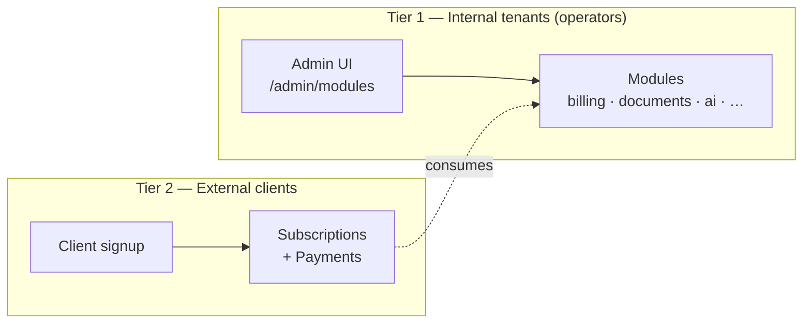

# Architecture

Orkestra is a **modular monolith** with an optional sidecar split for AI workloads. Three things matter most to understand the design:

1. **[Two-tier tenancy](/architecture/tenancy-model)** — operators run the platform; external clients subscribe to services it exposes. Every endpoint declares which tier it serves.
2. **[Module lifecycle](/architecture/module-lifecycle)** — two layers decide what runs: build tags (what's *installable*) and runtime config (what's *on*).
3. **[AI sidecar split](/architecture/ai-sidecar-split)** — the AI module chain can optionally run as a standalone service controlled by a single env var.

## Pages

- [Two-tier tenancy model](/architecture/tenancy-model)
- [Module lifecycle](/architecture/module-lifecycle)
- [AI sidecar split](/architecture/ai-sidecar-split)
- [Authentication flow](/architecture/authentication-flow)
