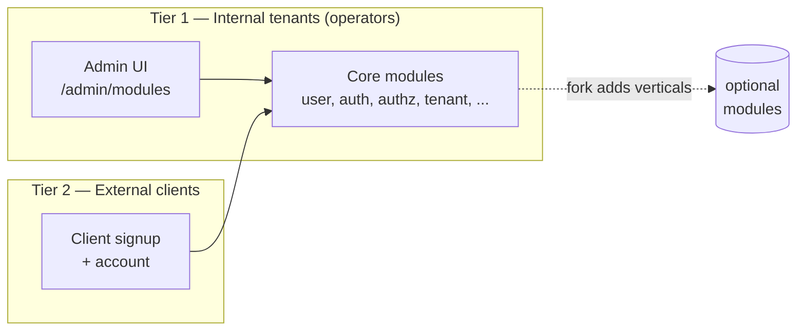

# Architecture

Orkestra is a **modular monolith** shipped as a [core-only base](/adrs/collapse-to-core-only-base): eight always-loaded core modules and the `Module` extension seam they're built on. Two things matter most to understand the design:

1. **[Two-tier tenancy](/architecture/tenancy-model)** — operators run the platform; external clients register against it. The two-tier *data* model is core; the consumption layer a fork builds on top. Every endpoint declares which tier it serves.
2. **[Module lifecycle](/architecture/module-lifecycle)** — every registered module compiles into the single binary; runtime config decides what's *on*. The base ships an empty optional-module catalog — a fork adds verticals through the same seam the core uses.

```mermaid
flowchart LR
  subgraph Tier1["Tier 1 — Internal tenants (operators)"]
    Admin["Admin UI<br/>/admin/modules"]
    Core["Core modules<br/>user, auth, authz, tenant, ..."]
  end
  subgraph Tier2["Tier 2 — External clients"]
    Client["Client signup<br/>+ account"]
  end
  Admin --> Core
  Client --> Core
  Core -. "fork adds verticals" .-> Addons[("optional<br/>modules")]
```

## Pages

- [Two-tier tenancy model](/architecture/tenancy-model)
- [Module lifecycle](/architecture/module-lifecycle)
- [Authentication flow](/architecture/authentication-flow)
