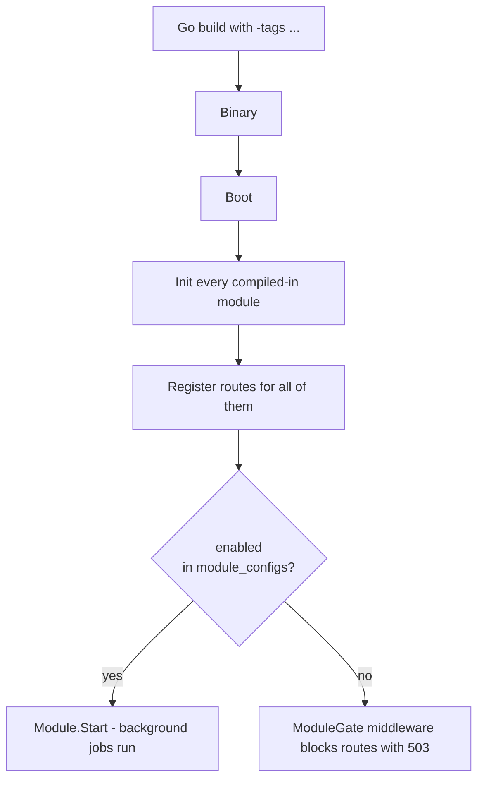

# Module Lifecycle

Two layers decide what runs in any given Orkestra instance.

## Layer 1 — Build time

Which addons are **installable** in this binary is decided at compile time. Each addon's wiring lives in `cmd/server/catalog_<addon>.go`, gated by a Go build tag:

```go
//go:build !no_addons || addon_<name>
```

Default builds compile every addon (enterprise SKU). A targeted build like `-tags "no_addons addon_billing addon_documents"` ships a curated subset. The `Makefile` defines named profiles (`make build-starter|minimal|billing|ai|saas|enterprise`) and CI builds the full matrix on every PR.

## Layer 2 — Runtime

All optional modules that compiled in are **instantiated, initialized, and routed** at boot — regardless of enabled state. Routes for disabled modules are gated by `ModuleGate` middleware (returns `503 Service Unavailable`). Only **enabled** modules have their `Start()` method called.



## Enabling and disabling at runtime

The admin API (`PATCH /v1/admin/modules/{name}`) calls `StartModule()` / `StopModule()` on the registry. The module starts or stops immediately — no restart required. Dependency constraints are enforced: you cannot disable a module that another running module depends on (returns `409 Conflict`).

## First-boot seeding

On the first boot of a brand-new install, the `module_configs` document is seeded from each module's `ConfigSchema().EnvVar`. If `ORKESTRA_PROFILE` is set (typically by `docker-compose.<profile>.yml`), the seeder additionally pre-enables that SKU's addons. **Subsequent boots ignore `ORKESTRA_PROFILE`** — admin-set values are authoritative.

## Initialization order

The registry topologically sorts modules by `Dependencies()`, so initialization order is always correct regardless of how they're declared.
