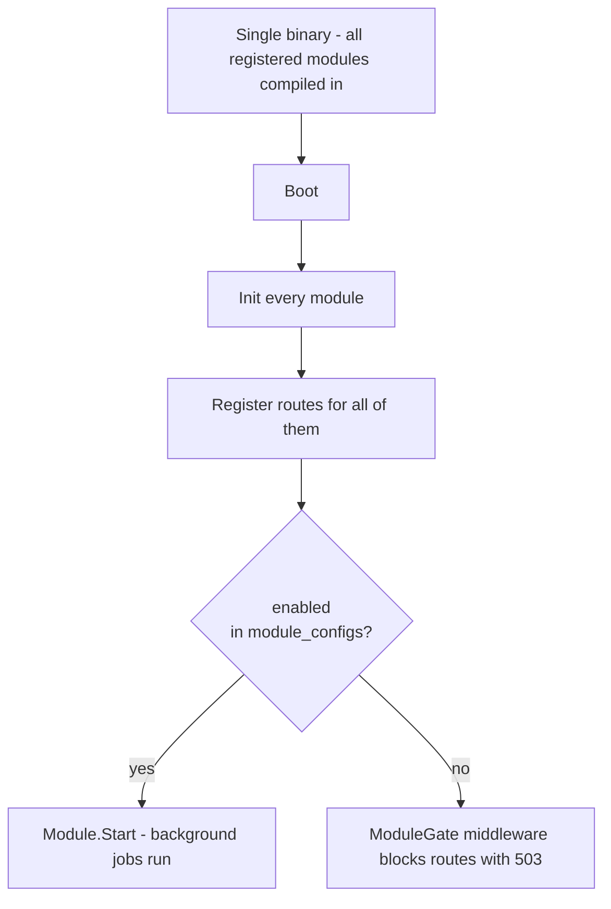

# Module Lifecycle

Orkestra is a **single binary** built from one Go module. Every registered module — the eight always-loaded core modules and any optional modules a fork adds — compiles in. There is no build-time selection: the only layer that decides what actually runs is **runtime configuration**.

## What compiles in

Each module's wiring lives in `cmd/server/catalog_<name>.go`. The eight core modules are always registered; a fork adds a vertical by dropping its own `internal/addons/<name>/` package plus a `cmd/server/catalog_<name>.go` that registers the factory in the `optionalModules` catalog via an `init()`. There are no Go build tags, no `BUILD_TAGS`, and no per-SKU build profiles — `make build` is the only build target, producing one binary and one Docker image.

The base ships an **empty** `optionalModules` catalog, so out of the box there is nothing optional to toggle — but the `/admin/modules` surface remains for forks that add their own.

## Runtime — enabled vs disabled

All optional modules that compiled in are **instantiated, initialized, and routed** at boot — regardless of enabled state. Routes for disabled modules are gated by `ModuleGate` middleware (returns `503 Service Unavailable`). Only **enabled** modules have their `Start()` method called.

```mermaid
flowchart TB
  Binary[Single binary - all registered modules compiled in] --> Boot
  Boot --> Init[Init every module]
  Init --> Routes[Register routes for all of them]
  Routes --> Start{enabled<br/>in module_configs?}
  Start -- yes --> Run[Module.Start - background jobs run]
  Start -- no --> Gate[ModuleGate middleware blocks routes with 503]
```

## Enabling and disabling at runtime

The admin API (`PATCH /v1/admin/modules/{name}`) calls `StartModule()` / `StopModule()` on the registry. The module starts or stops immediately — no restart required. Dependency constraints are enforced: you cannot disable a module that another running module depends on (returns `409 Conflict`).

## First-boot seeding

On the first boot of a brand-new install, the `module_configs` document is seeded from each module's `ConfigSchema().EnvVar` and the module's own `EnabledByDefault`. With an empty optional catalog there is nothing optional to pre-enable; a fork's optional modules seed from their own `EnabledByDefault`. Subsequent boots honor the admin-set values in `module_configs` (edited at `/admin/modules`) — those are authoritative.

## Initialization order

The registry topologically sorts modules by `Dependencies()`, so initialization order is always correct regardless of how they're declared.
